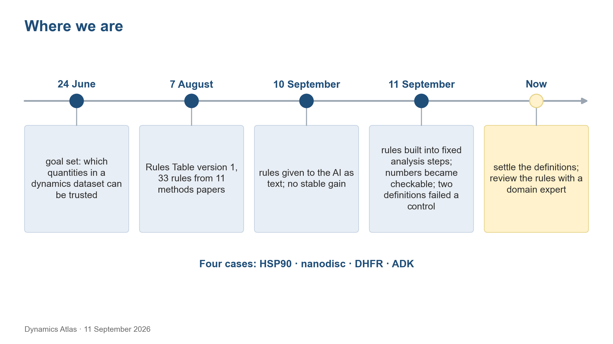
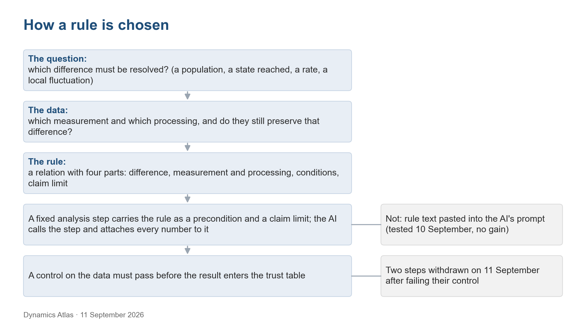

# What this project is doing, and how the rules fit

Updated 11 September 2026

## The goal we set out with

In July 2026 the project fixed its question: given a protein-dynamics dataset (MD trajectories, plus NMR, SAXS or FRET where they exist), which quantities about the ensemble can be trusted, and on what evidence? Two outputs were agreed: a table, per dataset, of trusted and untrusted quantities with the evidence behind each; and a workflow that produces such a table for a new dataset, with an AI analyst doing part of the work under explicit rules.

The rules were the starting idea. We took 33 cautions from 11 methods papers on smFRET, SAXS, cryo-EM, DEER and ensemble modelling, expecting them to steer the AI toward the analyses a kind of data needs, to make it notice missing evidence, and to keep it from conclusions the data do not support.

## What was built

Version 1 of the Rules Table, dated 7 August 2026, holds the 33 rules, three per paper, grouped by job: framing the question, checking the data, method guidance and limits on the conclusion.

The workflow has six steps: choose the question, prepare the data, frame the question, analysis, check the answer, report. The AI analyst does step 4, code runs the check in step 5, and a person, with code for data preparation, does the rest. Each group of rules entered at one step: as a warning file, as sub-questions, as text or cards added to the question, or as one automatic check after the answer.

Four cases were run on the authors' deposited data: the HSP90 N-terminal domain (Henot et al. 2022), a nanodisc (Bengtsen et al. 2020), DHFR with two inhibitors (Cetin et al. 2023) and adenylate kinase (Orädd et al. 2021). Each has a bounded result. WORKFLOW.md gives the history and the workflow table; RESULTS.md gives each case and the data files behind every number.

## What the tests showed

On 10 September 2026 each group of rules was tested at its step against the same setting without it, with the same model and four runs per condition. There was no stable benefit. The warning file about bad DHFR input was listed in all four runs and opened in none. Rule text helped on the nanodisc question and hurt on HSP90, where a FRET rule about dye models was applied to an NMR question because rules were selected by data type. The most serious errors happened before any rule could act: a periodic-image error in the DHFR input, which both AI answers accepted, and the framing of the first HSP90 question.

On 11 September 2026 the rules were put inside fixed analysis steps called operators. Each operator has a card stating what it answers, what must hold before it runs, and the strongest claim its result supports. The AI reports calculated numbers only by calling an operator, and each number carries the id of the result it came from. On eight earlier AI answers, comparing each number with the operator result it claimed to come from caught 6 of 7 known numerical errors and flagged none of 7 correct statements. The earlier check, which asked whether a number appeared anywhere in the tool output, caught none.

The same round showed where the problem sits. An operator executes a wrong definition as reliably as a right one. Two of our definitions failed a basic control: the reference-neighbourhood radius placed 99.99 % of open-start HSP90 frames outside both references, although 18 of the 20 open-start runs agree with the open-state NOE restraints at 1 Å. The AI reported that result faithfully and got full marks for it, because the scoring key was built from the same definition. The comparison with free analysis was confounded: 7 of the 8 free-analysis answers were cut off by tool-call and read-length limits and give no numbers, and two of the six scoring dimensions favour the operator arm by construction. That comparison had one scorer.

## Where the difficulty sits

A memo of 11 September 2026 put the project in three layers that have to hold in order. First, the criteria have to be right: what standard decides whether a population, a transition, a state reached or a local fluctuation can be trusted. That is a scientific question. Second, the calculation has to be right on real data. That is engineering. Third, the choice has to be right: given a new dataset and a question, which criteria apply and with which parameters. Only at the third layer does an AI come in.

Most of the effort went to the third layer, over five rounds of testing how the rules reach the AI. The second layer held on 11 September. The first layer was skipped. The 0.05 threshold in the state-fraction test and the neighbourhood radii were our own numbers, taken from no literature on sampling quality; Grossfield et al. 2019 had been read on 8 September and never entered the rules. Because the scoring key was written from the fixed pipeline's output, the evaluation graded the AI against our own definitions.

Reorganizing the table by question (version 2) made a further gap visible. None of the 33 original rules says when an MD quantity has converged, when a population can be stated, or when a state has been reached. They come from papers on combining experiments; 20 of the 33 concern smFRET, cryo-EM or DEER data that none of the four cases has. The criteria HSP90 needed were added in version 2 from Grossfield et al. 2019 and Prinz et al. 2011, and from our own mistakes. No domain expert has reviewed any rule or definition in either version.

## How a rule is chosen, as we see it on 11 September

Two readings shaped this view, both listed in SOURCES.md: Li, Thomasen and Cossio's blog post *Are we capturing the ensemble?* and Bhakat's T4 lysozyme benchmark. The first argues that the useful question is which differences between distributions a measurement, after its processing, can still tell apart. The second shows that sampling a region is not the same as recovering an experimentally confirmed state, and that coverage, weights and kinetics are separate claims.

Choosing a rule then starts from the difference the question must resolve: a population, a state reached, a rate, a local fluctuation. The next question is which measurement and which processing preserve that difference. A rule is that relation plus a claim limit. It is selected by the difference asked and the data at hand, not by data type. It acts through a fixed analysis step, never as text the AI may or may not read. Any definition inside a step has to pass a control on the data before its result is used. Version 2 of the table is the first pass at writing the rules this way; 22 rows still need the four parts made explicit.

## Three questions

1. Is a rules table the right form at all for improving what an AI analyst does, or should the effort go elsewhere?
2. If it is, does the way the rules are now organized and classified (version 2: by the question each rule helps answer, with a claim limit, acting through fixed analysis steps) look reasonable?
3. From your experience, what kinds of tools or constraints have actually improved an AI or automated analysis, and what has not?

Any other question you think we should be asking is welcome. The HSP90-specific definitions that need a domain judgment, such as what counts as near the open state and when a fraction has settled, are in DEFINITIONS.md with their controls.

## Where to look

| File | What it holds |
|---|---|
| README.md | The front page: the state of the project on 11 September 2026 and the questions asked there |
| RESULTS.md | The four cases, the tests of the rules in numbers, and the HSP90 trust table |
| DEFINITIONS.md | Every definition behind the HSP90 judgments, with its origin, its control and the open question |
| PLAN.md | Six steps for the Rules Table, in order, with the status of each |
| data/rules/RULES_TABLE_V2.md | The 42 rules of version 2, routed to the analyses they govern; version 1 alongside |
| WORKFLOW.md | The starting hypothesis, the six-step workflow and the tests of 10 and 11 September |
| data/README.md | What each data file contains and how to check every number quoted in the text |
| slides/ | The slides of 10 September 2026, with a reader page |
