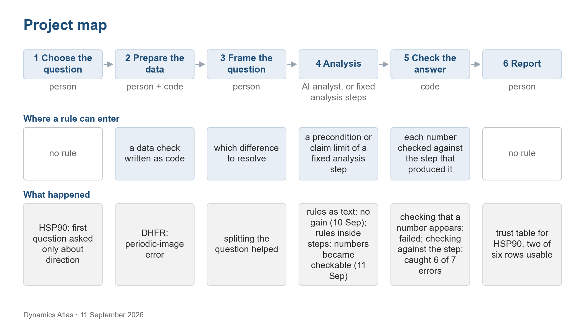

# Dynamics Atlas

Updated 11 September 2026 · Zhenpeng Liu · UNC

Given a protein-dynamics dataset (MD trajectories, plus NMR, SAXS or FRET where they exist), which quantities about the ensemble can be trusted, and on what evidence? The answer should come in two forms: a table, per dataset, of trusted and untrusted quantities with the evidence behind each, and a workflow that produces such a table for a new dataset, with an AI analyst doing part of the work under explicit rules. The rules were the starting idea: 33 cautions from 11 methods papers, expected to steer the AI toward the right analyses and away from over-reading the data.

## Start here

| Read | What it is | Time |
|---|---|---|
| [OVERVIEW.md](OVERVIEW.md) | What the project is doing, how the rules fit, and three questions for a reviewer | 10 min |
| [RESULTS.md](RESULTS.md) | The four cases and the HSP90 trust table | 15 min |
| [DEFINITIONS.md](DEFINITIONS.md) | Every definition behind the HSP90 judgments, with its control | 10 min |
| [data/rules/RULES_TABLE_V2.md](data/rules/RULES_TABLE_V2.md) | The rules, routed to the analyses they govern, with version 1 alongside | 15 min |
| [PLAN.md](PLAN.md) | What happens to the rules next | 5 min |
| [WORKFLOW.md](WORKFLOW.md) | History: the starting idea, the workflow, the tests of 10 and 11 September 2026 | as needed |
| [data/README.md](data/README.md) | The tables behind every number and how to check them | as needed |
| [slides/](slides/) | Slides of 10 September 2026 with notes, and the flowcharts ([`slides/Dynamics_Atlas_flowcharts.pptx`](slides/Dynamics_Atlas_flowcharts.pptx)) | as needed |
| [SOURCES.md](SOURCES.md) | Papers and deposited data | as needed |

## Status

| Item | Status | Date |
|---|---|---|
| Four cases (HSP90, nanodisc, DHFR, ADK) | Each has a bounded result from the authors' deposited data ([RESULTS.md](RESULTS.md)) | by 10 September 2026 |
| Rules given to the AI as text | No stable gain; one harm, when a FRET rule was applied to an NMR question | 10 September 2026 |
| Rules built into fixed analysis steps | The AI's numbers became checkable: 6 of 7 known numerical errors caught, against none with the earlier check | 11 September 2026 |
| The definitions inside those steps, and the HSP90 trust table | Two definitions failed a basic control; they are listed with the open questions in [DEFINITIONS.md](DEFINITIONS.md). Two of six trust-table rows usable | 11 September 2026 |
| Rules Table | Version 1 (33 rules) and version 2 (the same rules routed to the analyses they govern, plus 9 new ones) are both in [data/rules/](data/rules/RULES_TABLE_V2.md); 58 unreviewed candidates from the literature, grouped by decision point, in [data/rules/candidates/](data/rules/candidates/RULES_CANDIDATES_V3_20260911.md) | 7 August 2026 (version 1); 11 September 2026 (version 2 and candidates) |

## Change log

- **11 September 2026 (evening).** 295 relations extracted from 63 papers and rewritten as 58 candidate rules grouped by decision point, plus 12 harness rules from the AI-agent literature; all unreviewed. Literature index in [data/rules/candidates/](data/rules/candidates/) and [data/literature_relations/](data/literature_relations/).
- **11 September 2026.** Rules built into fixed analysis steps; the AI's numbers became checkable, with 6 of 7 known errors caught. Two definitions failed a control. Rules Table version 2. DEFINITIONS.md and PLAN.md added.
- **10 September 2026.** Four tests of the rules as text, cards, a warning file and a post-answer check; no stable gain.
- **7 August 2026.** Rules Table version 1, 33 rules.
- **July 2026.** Question and workflow fixed with the collaborator; HSP90 first case.

## Limits

Four AI runs per condition, compared by medians. Three of the four cases were used while the rules were being developed; ADK was new to them. The corrected DHFR distances and the ADK and nanodisc analyses are our own calculations, not AI results. The 11 September comparison had one scorer, and its free-analysis arm was cut short by tool limits, so it supports the checkability result and nothing about effect size. No rule or definition has been reviewed by a domain expert.

## About this repository

This branch holds the results, the data behind them, the rules and the slides. The analysis code, every AI run with its logs and the development history are on the branch [`feature/luna-runtime-v1`](https://github.com/alex051107/dynamics-atlas-harness/tree/feature/luna-runtime-v1/review); the platform code is on `main`. The operator round of 11 September, with code, every run, scoring and an external review, is on [`feature/operator-plan-review-20260911`](https://github.com/alex051107/dynamics-atlas-harness/tree/feature/operator-plan-review-20260911/review/operator-plan-20260911).
