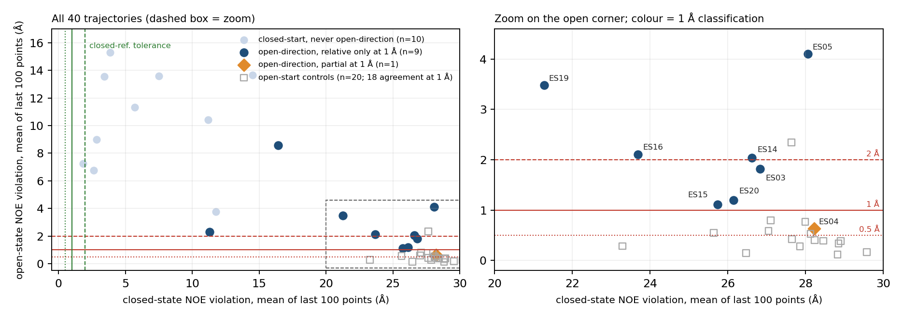
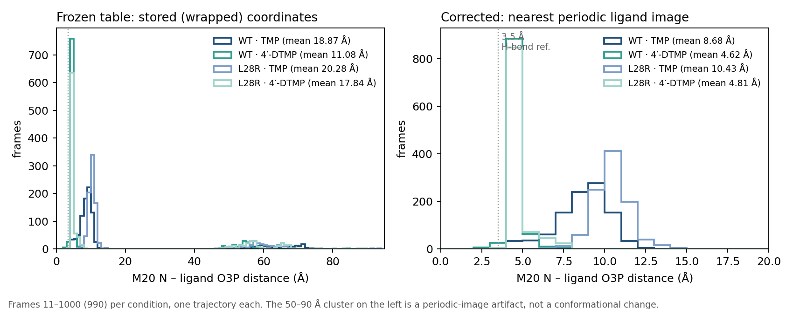
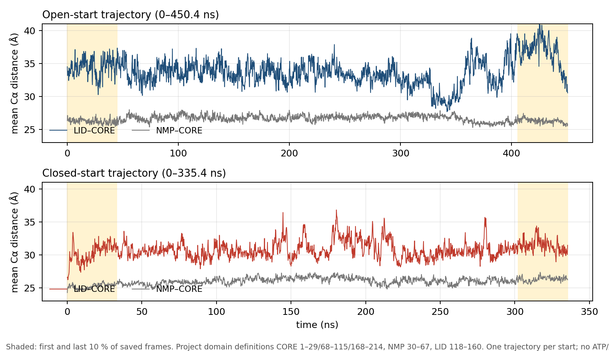

# Results, case by case

For each case: the paper, what the authors claim, what we tested, what we found, what the result can and cannot support, and which data files hold the numbers. Column definitions are in the [data guide](data/README.md).

| Case | Paper | What we tested | Short answer |
|---|---|---|---|
| HSP90 | Henot et al. 2022 | Does moving toward the open state mean agreeing with it? | Mostly not |
| Nanodisc | Bengtsen et al. 2020 | Does fitting SAXS better also fit NOE better? | No |
| DHFR | Cetin et al. 2023 | Do the deposited trajectories reproduce the paper's local contacts? | Yes, after correcting our input |
| ADK | Orädd et al. 2021 | What can the deposited MD say about ATP-driven closure? | Very little; the conditions differ |

---

## 1. HSP90 N-terminal domain

**Paper.** Henot et al. 2022, *Nature Communications* 13, 7601. [doi:10.1038/s41467-022-35399-8](https://doi.org/10.1038/s41467-022-35399-8)

**What the authors claim.** The closed state of the N-terminal domain is transiently populated. NMR relaxation shows exchange on the millisecond scale. In 40 MD trajectories of 1 µs, 20 started from the open crystal structure and 20 from a closed model, the authors use NOE violations to classify the closed-start runs as 7 near-closed, about 9 moving toward open, and 4 neither.

**What we tested.** If a trajectory moves toward the open state by a relative measure, does it also agree with the open-state NMR restraints?

**What we found.**

- 10 of the 20 closed-start runs show a sustained move toward the open direction: 5 whose first sustained segment is already open, and 5 that first held a closed direction and turned open later. None of the 20 open-start runs leaves the open direction.
- Against the authors' own NOE violations, with a 1 Å tolerance, 9 of those 10 spend most of their open-direction time far from both the open and the closed reference. One (ES04) partly agrees. None agrees throughout.
- The same test gives agreement for 18 of the 20 open-start runs, so it detects agreement when it is there.
- The change is real. In ES15 the mean open-state violation falls from 9.07 Å over the first 100 points to 1.12 Å over the last 100.

| Tolerance | Closed-start runs that agree with the open reference | Open-start runs that agree |
|---|---:|---:|
| 0.5 Å | 0 of 10 | 7 of 20 |
| 1 Å | 0 of 10 | 18 of 20 |
| 2 Å | 3 of 10 | 19 of 20 |

**What it can and cannot support.** Moving toward a state, agreeing with it, and completing a physical transition are three different claims; these trajectories support the first and only partly the second. With 1 µs runs and no returns they give no populations or rates. The count of runs moving toward open matches the paper's about 9 within one run; the paper's 7 / 9 / 4 classification uses a different criterion and was not reproduced.

**What it showed about the rules.** The question of whether a run reaches the open state came from going back to the original NMR data, not from any rule. When rules were added to the AI's question, the answers were not more accurate, and they asked for FRET-specific quantities (dye restraints, calibration) that do not apply to an NMR analysis.

**Open question.** 0.5, 1 and 2 Å on the mean NOE violation are working tolerances, not calibrated state boundaries. How should agreement with the open state be defined?

**Data.** [`data/hsp90/direction_event_counts.csv`](data/hsp90/direction_event_counts.csv) (10 of 20; 5 / 4 / 1 departures) · [`noe_crosswalk_per_trajectory.tsv`](data/hsp90/noe_crosswalk_per_trajectory.tsv) (classification and violation means for every run) · [`noe_crosswalk_summary.json`](data/hsp90/noe_crosswalk_summary.json) (counts at each tolerance)

---

## 2. Nanodisc

**Paper.** Bengtsen et al. 2020, *eLife* 9, e56518. [doi:10.7554/eLife.56518](https://doi.org/10.7554/eLife.56518)

**What the authors claim.** Reweighting an MD ensemble against NMR, SAXS and SANS together gives a nanodisc ensemble consistent with all three.

**What we tested.** If the ensemble is reweighted to fit SAXS alone, does agreement with the NOE data, which are left out of the fit, also improve?

**What we found.** Same weights applied to all three measures; 1195 frames.

| Measure | Before fitting | After fitting SAXS only | Change |
|---|---:|---:|---:|
| SAXS disagreement (90 points) | 10.02 | 1.17 | −88 % |
| amide NOE disagreement (292 restraints) | 0.933 | 0.965 | +3 % |
| methyl NOE disagreement (40 restraints) | 3.89 | 4.47 | +15 % |

With stronger regularization of the SAXS fit, the NOE measures still do not improve (0.971 and 3.93).

**What it can and cannot support.** A model that fits one observable better does not necessarily explain another one better. This is a conditional result for this ensemble and error model; it does not show that the SAXS and NMR data contradict each other.

**What it showed about the rules.** This is the one case where the full rule text helped the AI most: all four answers with full rules covered everything the question asked for.

**Data.** [`data/nanodisc/fit_summary.csv`](data/nanodisc/fit_summary.csv) (rows `uniform` and `saxs_theta6`, column `fixed_mean_loss`) · [`per_observable.csv`](data/nanodisc/per_observable.csv) (every SAXS point and restraint) · [`comparisons.csv`](data/nanodisc/comparisons.csv) · frame weights before and after the fit

---

## 3. DHFR with TMP and 4′-DTMP

**Paper.** Cetin et al. 2023, *Journal of Chemical Information and Modeling*. [PMC10428214](https://pmc.ncbi.nlm.nih.gov/articles/PMC10428214/). Trajectories: [Zenodo 7966540](https://zenodo.org/records/7966540)

**What the authors claim.** Trimethoprim (TMP) loses potency against the L28R mutant, and the analog 4′-DTMP restores it (Ki in nM: wild type 4.2 for TMP and 5.1 for 4′-DTMP; L28R 65.0 and 34.3). In MD, 4′-DTMP sits closer to atoms of the M20 loop and of R28.

**What we tested.** Do the deposited trajectories reproduce the paper's local contacts?

**What we found.**

- The first input table was wrong. It was built from stored coordinates, so in a group of frames the ligand was measured in a neighbouring periodic image, giving distances of 46 to 94 Å. Both AI answers accepted these numbers, and one explained them as conformational switching.
- After using the nearest periodic copy of the ligand, and checking against an independent calculation in VMD (largest difference about 10⁻⁵ Å):

| M20 N to ligand O3P (mean of 990 frames) | TMP | 4′-DTMP |
|---|---:|---:|
| wild type | 8.69 Å | 4.62 Å |
| L28R | 10.44 Å | 4.81 Å |

All six atom pairs the paper highlights move closer with 4′-DTMP, as in its Fig. 4.

**What it can and cannot support.** The direction of the local contacts agrees with the paper. With one trajectory per condition and no angle criterion, it says nothing about hydrogen bonds, affinity or mechanism.

**What it showed about the rules.** If the physical quantity is wrong before the analysis starts, no written caution about methods will save the answer. This kind of check belongs to data preparation.

**Data.** [`data/dhfr/ligand_distance_comparison.csv`](data/dhfr/ligand_distance_comparison.csv) (row `r20_N_O3P`) · [`distance_statistics_per_condition.tsv`](data/dhfr/distance_statistics_per_condition.tsv) · [`vmd_crosscheck.json`](data/dhfr/vmd_crosscheck.json)

---

## 4. Adenylate kinase (ADK)

**Paper.** Orädd et al. 2021, *Science Advances* 7, eabi5514. [doi:10.1126/sciadv.abi5514](https://doi.org/10.1126/sciadv.abi5514). Data: [Zenodo 5583119](https://zenodo.org/records/5583119)

**What the authors claim.** After ATP is released by light, time-resolved X-ray scattering shows a change over about 4.3 ms, interpreted with MD structures as the LID and NMP domains partly closing together.

**What we tested.** What can the deposited MD alone say about domain closure?

**What we found.**

The two deposited trajectories (450 ns and 335 ns) contain no ATP or AMP. Between the first and last tenth of each run, LID moves away from CORE by 2.29 Å (open start) and 1.18 Å (closed start), and NMP by 0.07 and 1.09 Å. The distributions from the two runs overlap. GROMACS reproduces our distances within about 0.005 Å.

**What it can and cannot support.** No net closure between these windows; closure episodes inside the runs are not excluded. The simulations and the experiment differ in ligand, temperature and time scale (nanoseconds against milliseconds), so this MD cannot test the paper's mechanism.

**What it showed about the rules.** After DHFR we wrote a general check: any distance longer than half the simulation box is an error. ADK broke it. The open protein is 56 Å long in a box of about 98 Å, so distances of 62 and 70 Å inside the protein are real. A protein–ligand contact needs the nearest periodic copy of the ligand; a distance inside one protein needs the molecule kept whole. A correct check depends on what is being measured.

**Data.** [`data/adk/domain_distances_open_start.tsv`](data/adk/domain_distances_open_start.tsv) and [`domain_distances_closed_start.tsv`](data/adk/domain_distances_closed_start.tsv) (every frame) · [`window_changes_recomputed.json`](data/adk/window_changes_recomputed.json)

---

## What the four cases have in common

| Case | Experiment that constrains the question? | What the case showed |
|---|---|---|
| HSP90 | yes: two NOE reference sets | Direction of change is not agreement with a state |
| Nanodisc | yes: SAXS and NOE | Fitting one observable does not fit another |
| DHFR | no: biochemistry only | Errors can enter before analysis, in how the data are represented |
| ADK | partly: different conditions | A check is only correct for a particular quantity |

The errors came in at different stages: how the data were represented, whether a method applied to the question, and what a measurement can actually distinguish. That is why the question has shifted from whether more rules help to which knowledge belongs at which stage.

## Tests of the rules, in numbers

Median over four runs of each question and condition; every answer is in [`data/rules_test/scores_per_answer.csv`](data/rules_test/scores_per_answer.csv).

| Kind of help | Measure | Without | With |
|---|---|---|---|
| Framing | HSP90: sub-questions covered (of 3) | 2 | 2.5 |
| Framing | ADK: sub-questions covered (of 3) | 2 | 3 |
| Data warning | DHFR bad input detected | 0 of 4 | 0 of 4 |
| Method guidance | HSP90: correct parts (of 5) | protocol 4.5 | full rules 2 · cards 2.5 |
| Method guidance | Nanodisc: correct parts (of 5) | protocol 4.5 | full rules 5 · cards 4.5 |
| Check after answer | Questions with fewer errors | — | 1 of 3 |

---

## Rules as operators (11 September)

What an operator is and why we tried it is in [README section 8](README.md#8-11-september-rules-turned-into-analysis-operators). Every number below is in [`data/operators/`](data/operators/).

**The HSP90 trust table.** Produced by the fixed pipeline, without any AI. The last column is our reading after an external review of the same day.

| Quantity | Operator result | Trust as stated by the operator | Status after review |
|---|---|---|---|
| Sustained direction and reversals (OP1) | closed start: 5, 4, 1 reversals at 5, 20, 50 points; open start: 20 of 20 stay open; no returns | within the 20–1020 ns window | usable |
| Agreement with the NOE references (OP2) | open start: 7, 18, 19 of 20 at 0.5, 1, 2 Å; closed start at 1 Å: 0 agree, 1 partly, 9 relative only | sensitive to the tolerance | usable; same-source, not independent validation |
| State fractions over time (OP3) | window-against-full differences below 0.05; about half of all points assigned to neither state; 0 of 40 runs return | not a population | fixed-window comparison only; the 0.05 criterion is not calibrated |
| Persistent changes (OP4) | 5 closed-to-open direction events in 5 runs; 0 returns | events exist | the same events as OP1; not completed transitions |
| Excursions (OP5) | 3 accepted of 42 candidates | descriptive | withdrawn: the reference radius fails the control below |
| Reference neighbourhoods (OP6) | open start: 99.99 % of frames outside both references | descriptive | withdrawn: 18 of these 20 runs agree with the open NOE references |

**AI runs.** Four answers per arm, one scorer, share of rubric points.

| Question | Fixed pipeline | Free analysis | Operator-bound |
|---|---:|---:|---:|
| HSP90 | 60 / 60 | 140 / 240 (58 %) | 236 / 240 (98 %) |
| ADK | 36 / 36 | 106 / 144 (74 %) | 144 / 144 (100 %) |

Seven of the eight free-analysis answers state that they could not read the question files and give no numbers; limits on tool calls and read length, added during setup to stop runs from exhausting their budget, cut them off. Operator coverage and numerical binding are two of the six scoring dimensions and favour the operator arm by construction. The scores show that the operator arm answered the questions and bound its numbers. They do not measure how much operators help.

**Checking numbers.** On the eight earlier answers, comparing each number with the operator result it should come from caught 6 of 7 numerical errors, and flagged none of 7 correct statements. Errors 1–3 are the threshold mix-ups in one HSP90 answer; 8, 9 and 11 are transcription errors in one DHFR answer; error 12, the nanodisc NOE bound array, has no operator to check against. The earlier check caught none of the seven.

**What it showed about the rules.** Rules placed inside operators reach the analysis every time, which text never did. But the definitions inside the operators decide the answer, and a wrong one is executed faithfully: the OP6 radius compares the spread of the NMR models with the distance of MD frames to those models, two different quantities. The rule table already holds this lesson (C005-RULE-001: quantities with different spatial support are not directly comparable); it was not applied to our own definitions.
