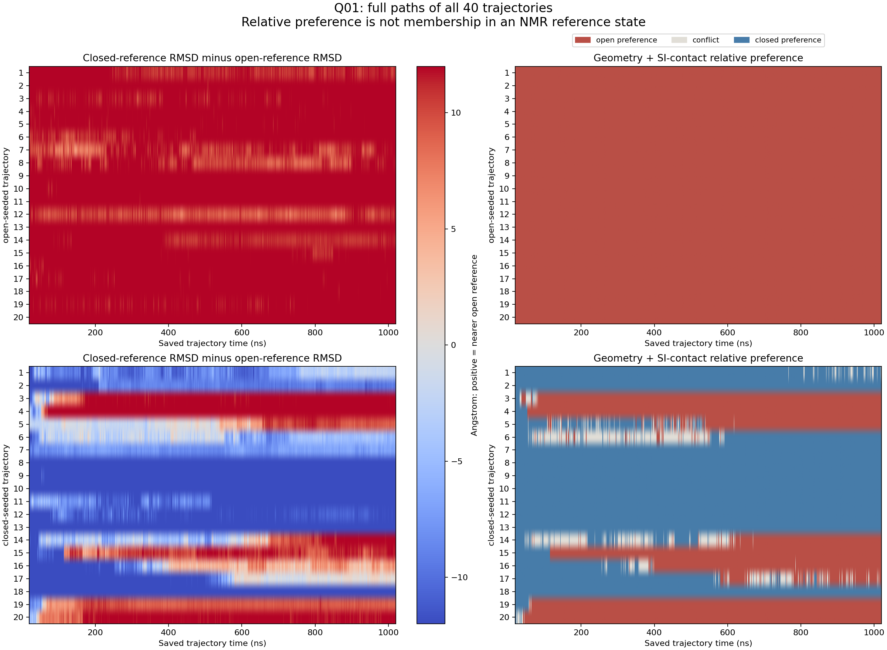

# Q01 已得到完整40条轨迹的有界方向性结果

在这些已发表的种子和模拟条件下，开放构象启动的20条轨迹均保持对开放参照的相对偏好；闭合构象启动的20条中，9条出现至少20个连续采样点的开放参照偏好，1条持续失去闭合偏好但两种几何指标没有一致转向，10条未出现持续偏好丢失。这个有限时间方向性在两套来源接触阈值下保持一致。

这里“偏好”要求core对齐后的lid主链RMSD和接触指标同时更偏向同一参照。两个接触分数按NMR开放/闭合集合的均值差分别归一化，然后取等权投影，避免直接比较19接触与5接触的未校准平均。正向表示更近开放参照；这不是概率。冻结方法见frozen_policy.json，40模型用于construction归一化，非独立实验或heldout。

| 连续采样点 | 开放种子：未持续丢失开放偏好 | 闭合种子：持续开放偏好 | 闭合种子：持续冲突 | 闭合种子：未持续丢失闭合偏好 |
|---|---:|---:|---:|---:|
|5（采样跨度4ns）|20|10|1|9|
|20（跨度19ns；主判据）|20|9|1|10|
|50（跨度49ns）|20|8|2|10|

两套接触定义在全部三项持续性条件下都给出相同的轨迹类别。逐帧偏好有342个差异，主类别变化0/40；阈值改变评分的幅度不等于科学结论增益。完整时间路径保存在full_preference_paths.tsv，图见full40_paths.png。时间点不是独立重复，统计单位保留为轨迹；不估计平衡人口或跃迁速率。

前一方法把NMR参照范围当作起始状态要求，导致40/40起点不被覆盖，不能回答原方向问题。本次作为已暴露的开发修订，保留范围外事实，仅比较相对方向；没有放大参照范围，也没有用作者轨迹标签、结果人数或阈值目标初始化。原方法失败在../q01_path_comparison_v1/。该结果支持比“真实进入开放态”更窄的相对方向判断；精确原文分组/亚稳性解释及领域最终判定仍未完成，因此完整题数尚不加一。

同一RuleInstance在已验证的全体初始范围缺口后实际产生一项新义务：on1/off0，复用全部40条坐标衍生结果，gmx新调用0、优化0。EvidenceResult逐项重算后，状态从方法不能回答起始态，变为“两套方法下相对方向稳定”；保留原范围缺口。它证明这项窄Rules能组织必要方法跟进和消费数值结果，没有证明相对专家正确流程的准确率增益。

核验：5项主路径检查（首次语法错误修复后通过）、2项跟进检查通过；40轨迹源评分、完整时间轴与数值回放通过。相邻C–N最大距离0.147221nm。记录位于artifact_check.json。保留旧结果，未重复轨迹读取。Pro审阅将在同一PR发布后进行。
