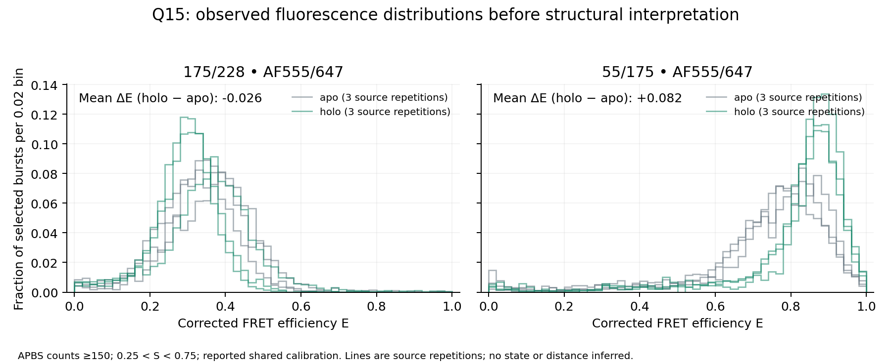

# Q15首次真实APBS比较

在140个原始光子导出文件中读取364,326个事件；按原始总光子≥150、明确的背景/串色/γ/β校正及0.25<S<0.75，选中44,451事件。两对位点各有apo/holo三组源标记重复。计算使用匹配ALEX Suite支持的秒与背景曝光口径；Peter2022实际二进制版本未给出，因此这是明确报告方法的source-compatible重分析。

| 位点 | apo三重复均值 | holo三重复均值 | holo−apo | 两组重复所有交叉差范围 |
|---|---:|---:|---:|---:|
| 175/228 | 0.339156 | 0.312987 | −0.026169 | −0.076140至+0.040806 |
| 55/175 | 0.724613 | 0.806602 | +0.081990 | +0.053158至+0.128408 |

55/175的增加在源重复间方向一致；175/228的小幅平均下降未超过所有重复间变化的范围。该范围是描述性范围，不是置信区间或显著性检验。不能将44,451个事件当成同等数量的独立实验来稀释共享校准误差。

保留180个选中事件的负校正计数，715个选中E越出0–1；没有为了让分布好看而截断。源代码旧实现的负值裁剪未照搬，差别在方法事实中明示。分布与逐文件/重复统计均保存；未拟合高斯或将均值换成物理距离。

这批是首次主计算，0Rules-extra。原始Q15入口拒收保持。需要下一步规则/证据处理的是测量口径与探针适用性、匹配正交证据和实际差异；不能仅因含175就否定全部FRET。TMR/Cy5双标事件在完整发布工作簿中为空列，换染料对照仍未完成；DEER与探针几何也不由Cα距离替代。原Q15完整科学问题仍未回答。
