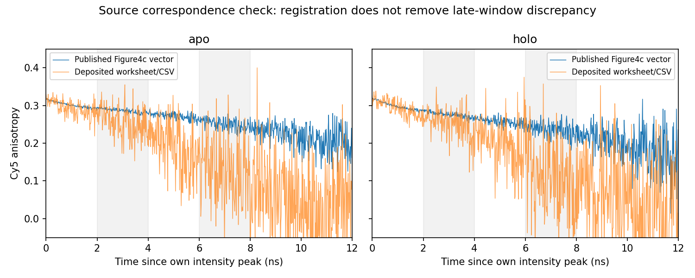

# Q15 Cy5 图文来源对应的数值核对

按原论文Figure4c的明确轴刻度和原PDF矢量路径，分别找到黑色apo与红色holo曲线的强度峰，注册后比较峰后2–4与6–8ns。图文晚窗差异仍约0.126，没有被时间注册消除。

| 条件 | 窗口ns | 原图各向异性均值 | 存档均值 | 差 |
|---|---|---:|---:|---:|
| apo | [2.0, 4.0] | 0.286626 | 0.256374 | 0.030251 |
| apo | [6.0, 8.0] | 0.251194 | 0.125315 | 0.125879 |
| holo | [2.0, 4.0] | 0.275915 | 0.252848 | 0.023067 |
| holo | [6.0, 8.0] | 0.236730 | 0.110890 | 0.125840 |

这里两边都用未加权窗口均值，区别于之前强度加权供体诊断。原图有效窗口内有124–125矢量顶点，存档126点；0.016ns采样及矢量量化使边界点数略不同，没有将它解释为统计重复。原图峰在显示时间约1.48/1.51ns，存档用各自真实强度峰注册。SVG具有C段，解析器保留立方曲线的精确纵向极值；两个实际峰均落在原顶点，未误把控制点当观测。

原图与存档Cy5观测不宜当同一数值曲线使用。尚未识别差异源于记录选择、背景处理或其他原因；不指定哪个来源错误，不把相似曲线改名。未使用作者拟合寿命/距离，未重拟合，未把该来源核对计为Rules数值补算。Q15候选答复此前已排除Cy5机制使用，这个结果支持保留该限制。

