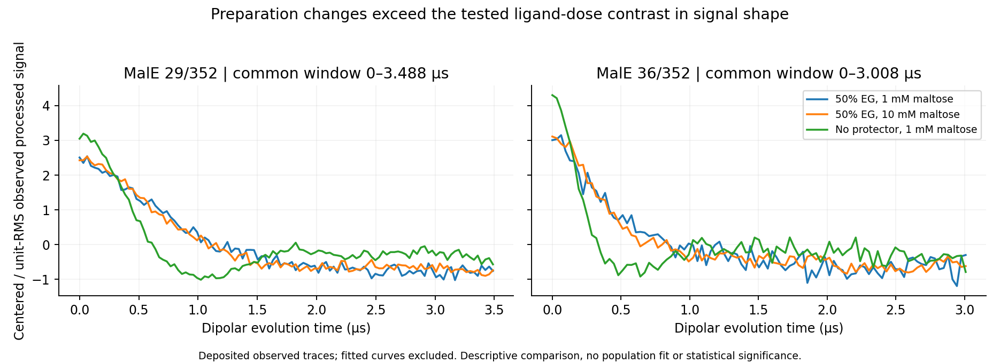

# Q16：在相同时间窗内，保护剂变化大于所测配体剂量变化

两组MalE位点都观察到相同排序：从50%乙二醇改成无保护剂的信号形状差异，大于麦芽糖从1mM增至10mM的差异。29/352共同窗口0–3.488µs（110点），36/352为0–3.008µs（95点），按已有处理信号的交集固定，不插值、不延长短曲线。

| 位点 | 作者处理后实测信号：剂量差异 | 去保护剂差异 | 后者/前者 |
|---|---:|---:|---:|
|29/352|0.177590|0.676867|3.811|
|36/352|0.293812|0.726143|2.471|

差异定义为各曲线中心化并除自身RMS后的均方根距离，去除常数偏移和整体幅度这一明确干扰约定。原始实部信号对应比值2.706/1.789；用存档背景相除后比值4.916/3.527，三条处理路径保持排序。三条路径来自同一观测，不作为独立复现实验。25%乙二醇和25%甘油也列于数值证据，其中29/352处理信号差异分别0.155322和0.350693。

科学含义：这些实际信号支持制备条件敏感性；单纯以增加麦芽糖剂量解释去保护剂的全部变化，缺少本比较支持。当前结果未确定结合常数、状态人口或因果机制。独立实验重复和噪声模型未核准，不能把点数用作生物重复或给出显著性。背景重新拟合和DEER反演尚未执行；作者最终拟合曲线、距离分布和状态标注全部排除在本算子输入之外。

规则行为：保存现行DraftRules基线后，新增开发规则Q16R01由实际记录时长差异触发共同窗口比较。on实际1次operator、off0次；同一输入/实例从待共同窗口证据变为该比较完成，仍要求状态参照/反演可辨识性及实验不确定性，完整Q16保持未决。数值证据接收时作一次便宜的确定性复核，0迭代拟合。该窄适配不冒充原有通用Rules已覆盖方法内容。

验证：3项定向测试通过，覆盖规则开关、共同网格、偏移/尺度不变性、错误来源角色和篡改证据。图已查看。当前完整开发答案仍1/20，Q16新增部分科学结果。
