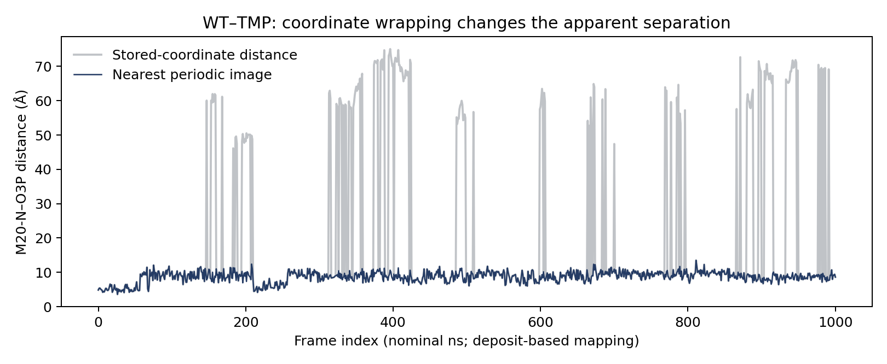
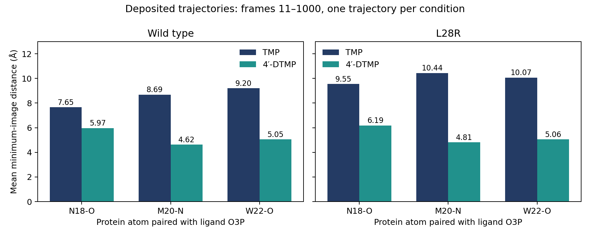
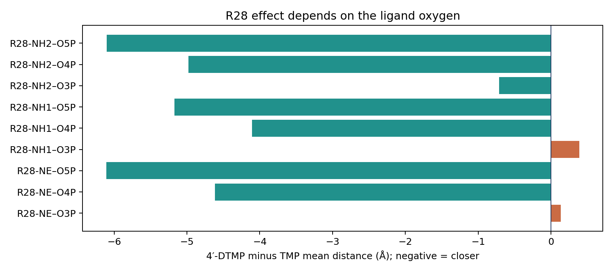

# DHFR 的配体接触比较：已有科学结果与 Agent 输入缺口

本轮主要是单一来源 MD 内部的配体距离比较，论文的亲和力和抑制实验提供定性背景；每个条件只有一条轨迹，独立轨迹数 n=1。它检验换一套数据后既有分析流程的复用，不构成异质资料可比性的验证。科学数字来自开发者修正周期性坐标后的计算，两份 Agent 在缺陷输入上的答复不作为分析能力证据。

**四条作者沉积轨迹支持一个具体结果：4′-DTMP 在 WT 和 L28R 两种背景下都更靠近 N18、M20、W22 的指定原子；L28R 的 R28–O4P/O5P 接触也明显更近。这个结果来自开发者补充的周期性坐标处理，不能算作两次 Agent 自主完成的科学验证。**

本轮依照既定计划选择第二个蛋白 DHFR，取得约 1.02 GB 的四条件全原子轨迹及拓扑、论文全文和作者代码，使用既有 VMD 提取局部距离。两次普通 Agent 使用同一冻结资料，未加入 Rules Table。建包后的数值核查发现，直接读取包装坐标会产生不真实的大距离。因此，报告保留原始试跑，并另列坐标修正后的开发者分析。实验费用和逐答复审计见后文及配套表。

## 1. 为什么这个问题值得做

二氢叶酸还原酶（DHFR）参与叶酸代谢，是抗菌药物的靶点。TMP 是甲氧苄啶；4′-DTMP 是论文研究的衍生抑制剂。WT 指野生型，L28R 指蛋白第 28 位由亮氨酸替换成精氨酸。精氨酸侧链带有能够参与局部相互作用的含氮基团，因此同一个配体尾部在两个蛋白背景下未必保持同样的接触。

Çetin 等 2023 年论文同时比较了结合亲和力、酶抑制实验和分子动力学轨迹。它适合作为 Dynamics Atlas 的第二个真实案例：我们可以直接计算作者指定的原子对距离，再讨论这些结构读数如何与实验现象关联。这里的产出标准是得到有数据依据的科学回答；是否存在 Rules 的额外收益不属于本轮问题。

## 2. 论文实际做了什么

论文先用实验亲和力和自由能微扰计算讨论 WT→L28R 对两种抑制剂的影响，然后用底物消耗实验比较抑制表现，最后分析配体附近的距离、氢键网络和蛋白网络社区。

这几步分别回答不同问题。抑制常数 Ki 描述实验条件下的抑制亲和力尺度，值越小通常表示越强。底物消耗曲线显示反应进程。原子对距离显示空间邻近。氢键判定还需要角度，网络社区则描述作者所定义接触图的分组。一个距离变短不能直接给出解离速率，也不能替代自由能计算。

论文图 4 选择了 N18-O、M20-N、W22-O 与配体 O3P 等原子对，以及 L28R 中 R28 的 NE/NH1/NH2 与 O3P/O4P/O5P。作者报告 4′-DTMP 形成更多局部相互作用。本轮检验这些指定比较，不重新定义一个全蛋白状态。

来源：[主文](https://pmc.ncbi.nlm.nih.gov/articles/PMC10428214/)，Table 1、Figures 3–4、System Preparation、Analysis of Hydrogen Bonds；[作者代码](https://github.com/midstlab/JCIM_Cetin_etal_2023/tree/eba9948e57f25cec9eb9bdb50cfdb234fc23fffc)，Figure 4 段。

## 3. 我们实际拿到了什么

|对象|已核对内容|用于什么|
|---|---|---|
|四条 DCD 轨迹及各自 PSF|WT/L28R × TMP/4′-DTMP；每条 1,001 帧、159 个蛋白残基；第 28 位分别为 LEU/ARG|逐帧局部原子对距离|
|沉积说明|每条 1 μs、stride 500；CC-BY 4.0|来源身份、名义时间映射、许可|
|主文全文 JATS XML|全文、表 1、图注；检索用 Markdown 由 XML 一次转出|方法和作者论断|
|图 3、图 4 原图|实验曲线和作者距离图|实验定性关系与图示比较|
|作者脚本固定提交|指定原子名及 VMD measure bond|已有方法复用|

下载原始字节与作者公布的校验值一致；完整 URL、字节数、SHA256 和许可证在 [下载清单](../DOWNLOAD_MANIFEST.json)。没有下载新 MD 所需输入，也没有开展新模拟。

配体原子 O3P/O4P/O5P 在 TMP 拓扑中属于残基 300，在 4′-DTMP 中属于 303。脚本按实际拓扑定位每个唯一原子。不能照搬某个 Tcl 文件里的分子编号或残基编号。拓扑核对见 [原子映射](../provenance/atom_mapping.tsv) 与 [轨迹信息](../provenance/trajectory_metadata.tsv)。

实验使用带 C 端 His6 标签的蛋白和 MTEN pH 7 缓冲液；模拟使用作者的结构构建体、TIP3P 水、0.15 M KCl 和 NADPH。二者支持相同突变和配体条件下的模式比较，不是完全相同实验环境。论文方法中部分浓度照录原文，未为使其合理而自行改单位。

## 4. 从坐标到距离：哪里出了问题

我们先执行与作者脚本相同的欧氏距离操作：两原子坐标相减，再求向量长度。直接计算得到 WT–TMP 的 M20–O3P 平均距离 18.88 Å，个别帧超过 70 Å。作者图中的相应局部接触约为 9 Å。这个尺度差异触发了坐标检查。

周期性边界会把越过盒子边缘的原子重新放到另一侧。两原子可以在物理上很近，存储坐标却隔着一个盒长。这里需要寻找最近的周期镜像。对已经检查为正交的盒子，各方向采用 d′ = d − L·round(d/L)，然后计算三个修正分量的长度。盒子长度逐帧读取，没有用固定盒长代替。

灰线是同一 WT–TMP 轨迹的存储坐标距离；蓝线是最近周期镜像距离。横轴是帧编号；根据沉积说明可对应名义 ns，但重写后的 DCD 头不是独立物理时钟。两条线的差别来自坐标表示，不是另外一条模拟。

原始提取：[脚本](../reproduction/extract_distances.tcl)、[执行日志](../provenance/vmd_extract.log)。后置诊断：[预先写下的诊断说明](../PERIODIC_COORDINATE_DIAGNOSTIC_PROTOCOL.md)、[镜像处理脚本](../reproduction/diagnose_periodic_images.tcl)、[数值汇总](../mic_diagnostic/distance_summary.tsv)。最近镜像是既有周期性处理方法，参见 [GROMACS 方法文档](https://manual.gromacs.org/2024.4/reference-manual/algorithms/periodic-boundary-conditions.html)。

用另一条现成路径复核：VMD pbctools 按蛋白质心重包装，再调用 measure bond，四条件全部原子对与分量式最近镜像的最大差异为 0.00001132 Å，低于预设 0.0001 Å 容差。见 [交叉核对](../PBC_VALIDATION.json)。

**这次建包冻结得过早。** 文件完整、原子身份正确，只证明资料能读取，还没有证明距离表示适合接触解释。第一份 Agent 已经启动后才定位这个问题。两份原始输入不被替换；补充计算单独保留。原始答复中的大距离不能用于认定论文错误，也不能用修正后的结果事后给 Agent 加分。

## 5. 周期性处理后的局部结果

主分析取帧 11–1000，共 990 帧。名义时间为 11–1000 ns，来自“1 μs、1,001 帧”的沉积说明，意在遵循作者去除起始 10 ns 的方法。每个条件只有一条本轮使用的沉积轨迹。帧间相关，不能把 990 帧当作 990 个独立实验。

|背景与蛋白原子|TMP–O3P 均值 Å|4′-DTMP–O3P 均值 Å|4′-DTMP − TMP Å|
|---|---:|---:|---:|
|WT N18-O|7.65|5.97|−1.68|
|WT M20-N|8.69|4.62|−4.07|
|WT W22-O|9.20|5.05|−4.15|
|L28R N18-O|9.55|6.19|−3.36|
|L28R M20-N|10.44|4.81|−5.63|
|L28R W22-O|10.07|5.06|−5.01|

六项指定比较方向一致：4′-DTMP 更靠近这些局部原子。每根柱是一个条件轨迹中指定原子对的时间均值，单位 Å。图没有跨轨迹置信区间，因为没有独立重复可估计这类区间。均值不等同于氢键占有率；例如平均 4.81 Å 可以来自近距离和远距离帧的混合。

L28R 的 R28 更有选择性。NE–O4P 从 8.21 降到 3.60 Å，NE–O5P 从 9.84 降到 3.73 Å；NH1/NH2 到 O4P/O5P 的六项比较全部变近。O3P 则不同：NE 和 NH1 略远，NH2 变近。因此可以说“增强特定尾部接触”，不能说“R28 所有原子对都增强”。

横轴是 4′-DTMP 减 TMP 的平均距离，负值表示更近；每行一个 R28–配体原子对。该图直接说明限定原子对的重要性。所有原子对、全窗口均值及帧内标准差保存在 [完整统计](../mic_diagnostic/reference_statistics.json)。论文图 4 的趋势与本轮处理后的结果相符；本轮没有从图片数字化精确柱高，也没有复现作者全部重复，因此不报告“数值复现误差为零”。

## 6. 这些距离与抑制实验合起来能说什么

表 1 报告 WT 中 TMP 与 4′-DTMP 的 Ki 分别为 4.2±0.5 和 5.1±1.0 nM；L28R 中为 65.0±7.5 和 34.3±2.9 nM。这些值在该文中注明来自参考文献 25，并非本轮测量。

L28R 中 4′-DTMP 的 Ki 约为 TMP 的一半，按 65/34.3 计算为 1.90 倍差异。WT 两种抑制剂的 Ki 接近，且都比对应突变体小。局部接触与整体亲和力之间没有简单的“越近就一定越强”对应。

图 3 在 500 nM 抑制剂条件下显示：WT 加任一药物都基本没有底物消耗；L28R 中两者均减慢反应，4′-DTMP 更明显。图展示重复实验，但本轮没有原始数值曲线，不能据此拟合速率常数。

可交付的科学判断是：**沉积轨迹中的配体尾部接触差异，与 L28R 的配体选择性实验表现相容；这些资料尚未证明某一个局部接触是抑制差异的唯一原因。** 本轮没有自由能微扰原始计算，也没有完整的解离动力学，因此不把论文的动力学机制解释写成本轮独立证明。

## 7. 两份 Agent 答复如何看

两次均使用现有 Luna medium、自主工具循环、同一冻结资料，不附 Rules；容器只看到 /source 和独立 /work。原始轨迹留在开发者侧，Agent 仅得到直接距离表和论文材料。这种输入允许它汇总，但不允许它自行重建周期性坐标。

第一份答复确实调用 Python，计算距离和阈值比例，正确转述表 1 和图 3 的主要关系。但其物理解释使用了受坐标包装影响的均值，不能当作已确认的接触结果。此外，它把图 4 关于平均距离的讨论转成逐帧 <6 Å 比例，二者不是同一个统计量；若使用这个比例，应明确这是新增描述，而非论文指定氢键指标。

逐次完成状态、花费、计算核对及第二份的全文审计记录在 [两次答复审计](../AGENT_AUDIT_ZH.md)。原始稿保留在 [A1/A2 原始交付](../AGENT_RAW/)，没有被本报告改写。两份答复中没有处理周期性坐标的结果不得借用本轮开发者诊断冒充完成。

## 8. 对项目下一步的意义

第二体系已经产生了可解释的局部科学结果，也暴露了一个明确的资料准备缺口：把派生距离交给 Agent 前，必须处理并记录周期性坐标语义。仅增加一条“谨慎解释”的文字规则无法恢复未提供的坐标和盒子信息。

因此，本轮支持继续完善最小可复用的资料入口：已有 VMD 方法、明确的原子映射、周期性处理记录、逐帧数值和可追溯的论文问题。它没有测 Rules 增益，也没有建立全自动跨体系能力。正式结果必须区分“开发者整理和修正”与“Agent 实际执行”。

本轮在两次 A-only 后结束，不启动第三体系、不补跑修正后的 Agent、不为追论文图调阈值。修正后的资料可供下一阶段使用，但须作为新版本，不能替换本轮冻结数据。

## 附录：复跑、术语与来源

复跑顺序：下载脚本按固定 Zenodo 记录取四个 PSF/DCD → VMD 读取与原子定位 → 原始逐帧距离 → 最近镜像诊断 → Python 统计。两份 Agent 的执行命令、模型和容器身份见 [复跑说明](../REPLAY.md)。代码使用任务根目录参数，模型侧不出现个人本地路径。

|术语|本轮具体含义|不能升级成|
|---|---|---|
|M20 环|包含相关活性位点残基的柔性区域；本轮只测指定原子|全环自由能或完整动力学|
|O3P/O4P/O5P|作者拓扑中的配体氧原子名|不同配体中未经核对的通用位点|
|平均距离|990 个相关帧的距离算术均值，Å|氢键占有率、独立重复均值|
|最近周期镜像|同一物理体系的邻近复制坐标|新增模拟或新构象采样|
|Ki|论文报告的抑制常数，nM|解离速率或唯一机制|
|A-only|未附 Rules 的工具型 Agent|没有任何共同科学说明的裸模型|

图与 slides 对应：研究问题与来源 → 第 1–3 节；周期性问题 → 第 4 节；局部距离 → 第 5 节；实验边界 → 第 6 节；Agent 与项目决定 → 第 7–8 节。主张和文件定位见 [主张来源表](claim_source_map.jsonl)。
