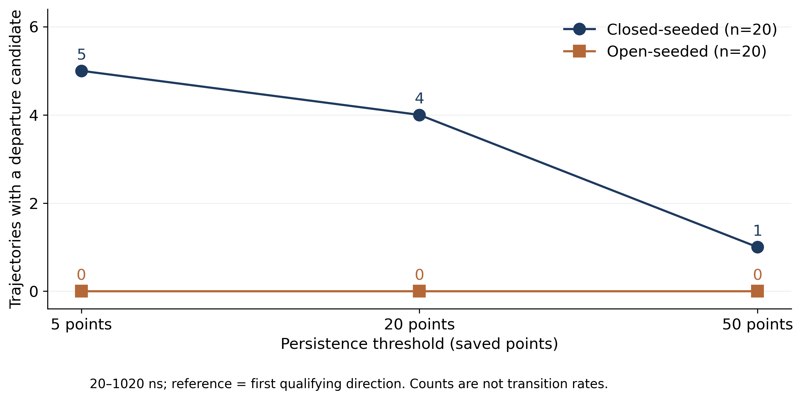
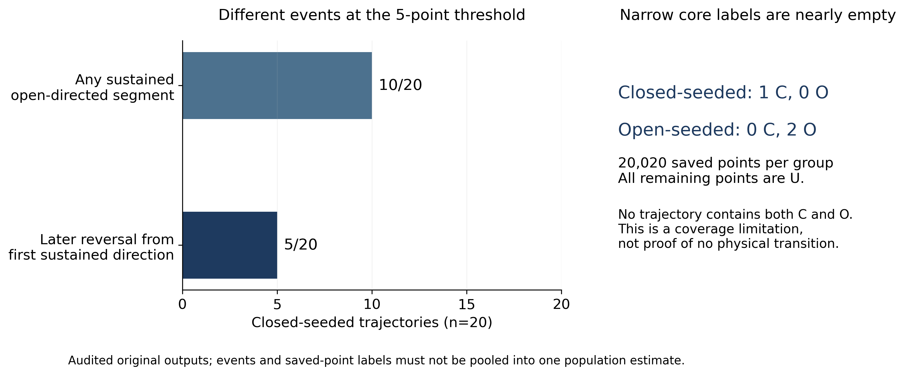

# HSP90：从轨迹中的方向变化，到规则提示的实际价值

本读本重组已核对的首轮结果，帮助读者解释科学问题、复查实际代码，并准备会议讨论。**科学结果是两种起始组在既定读数下表现不同；研究方法上的结果是规则组出现混合表现，尚不足以自动扩大试验。** 所有核对由开发 Codex 完成，不是独立领域评审。

## 怎么读

先读第一部分了解为什么研究这个蛋白，再读第三、四部分理解三个不同的计数。如果只准备会议，下面的对照表可以定位每一页。附录给出术语、图的含义、实际代码位置和可复核边界。文中的“观察”指本轮资料或执行记录；“解释”指开发者据此作出的判断；“建议”尚未实施。

|幻灯片|要说明什么|读本位置|结果或代码|事实编号|
|---|---|---|---|---|
|1–3|研究目的与实际问题|第一部分|共同题面|H07、H18、H20|
|4–5|论文背景与输入|第一、二部分|资料卡|H01、H14–H16|
|6|四个自主答复如何比较|第五部分|冻结运行记录|H07、H18|
|7|持续门槛如何改变候选数|第三部分分析一|图一；B2第二个Python请求|H02、H05、H19|
|8|不同事件为何有不同计数|第三部分分析二|图二；A1第四个请求|H03、H04|
|9–10|规则收益与问题分别是什么|第五部分|四份全文核对表|H08–H13|
|11|与论文相容到什么程度|第四部分|论文关系表|H14、H15、H20|
|12|下一步该决定什么|第六部分|停止判断|H13、H17|

## 第一部分：先弄清生物学问题

### 蛋白上的“盖子”在这里指什么

HSP90 是分子伴侣，帮助其他蛋白维持或获得合适的结构。这里研究人 HSP90α 的 N 端 ATP 结合结构域，即蛋白中参与结合 ATP 的一部分。ATP-lid 是靠近结合位置的一段结构，可以呈现更开放或更闭合的构象。“盖子”是帮助理解的比喻，不能据此假定它只有两个刚性状态。[H14]

本题研究的是无配体资料，分成从闭合参考和开放参考开始的两组模拟。起点不同，可以影响有限时间内看到的构象。资料中的 R46A/R60A 表示起始结构来源；它们不能直接成为当前两组的突变效应标签。若把来源名称当作当前分子构建体，就会把起点依赖误讲成突变造成的生物差异。[H01、H16]

### Henot 论文实际上做了什么

Henot 等的《Visualizing the transiently populated closed-state of human HSP90 ATP binding domain》发表于 Nature Communications。研究结合核磁共振、结构参考、突变与分子动力学，讨论暂时出现的闭合构象及开放、闭合之间的关系。论文第 5–6 页及 Fig.4 报告开放起始轨迹相对稳定，而闭合起始轨迹表现不一致：约七条近闭合、约九条近开放、四条处于两者都不明确的区域。作者也指出模拟不具遍历性。[H14]

“遍历性”在这里关系到一个实际问题：从有限轨迹积累的构象频率，能否代表平衡时系统会出现哪些构象、各占多少。起点仍明显影响所见结果时，直接把轨迹比例当成平衡人口缺少依据。本轮没有估计这一人口，也没有估计物理转换速率。[H14、H18]

论文还通过 CPMG 弛豫色散分析交换。这个实验观察核磁信号随脉冲条件的变化，再在交换模型下估计参数。正文第 6 页报告 293 K 时少数态约 3.2%。少数交换态与闭合结构的对应属于作者模型解释。这是作者实验拟合结果，不能用本轮“十条轨迹出现过开放片段”替代，也不能说本轮重新测得了它。[H15]

### 为什么选择这个问题

这个案例同时有结构参考、实验解释和时间序列派生量，正好暴露“一个字段写了 transition，它是否真的证明了物理转换”这一问题。它也已经被开发过程研究过，因此适合检查工具循环、规则适用性和评价方式；它不适合作为未见来源上的泛化测试。[H18]

本轮公开题目的核心是：**在无配体的人 HSP90α NTD 中，闭合 ATP-lid 起始轨迹是否更容易离开原有构象，并出现闭合到开放转变？** 两组 Agent 都被要求检查数据字段与论文的定义关系，报告可复核变化、依据和仍相容的解释。这个共同要求已经包含科学提醒；额外规则的效果是在这份共同说明之上测量的。[H07]

## 第二部分：我们交给 Agent 的是什么

### 数据、条件和统计单位

|对象|本轮实际提供|用途|保留的边界|
|---|---|---|---|
|论文、补充资料及文章文本|主文 PDF、SI PDF、已有文本提取|核对作者定义、方法与结果|文本便于检索；图与公式以PDF为准|
|逐帧派生表|每条轨迹1001个保存点，20–1020 ns，间隔1 ns|重算方向及连续段|不是原始原子坐标|
|轨迹摘要|每条轨迹分别按5、20、50保存点作汇总|比较门槛敏感性|同一轨迹的重复描述，不增加样本数|
|方向段和分箱表|连续方向段；名义50帧汇总箱|核对事件与另一时间分辨率|分箱中位数不能恢复逐帧连续性|
|字段定义与资料卡|几何、接触、核心区域、起点与来源说明|让两组理解同一份资料|不是作者原生状态映射已验证的证明|

每组二十条轨迹是本轮组间描述的单位。一条轨迹中的相邻保存点有关联，不能当作独立重复。每组二十条轨迹、每条一千零一个点，因此核心点数量的分母是每组二万零二十个保存点；这仍不能变成二万多个独立实验。[H01、H04]

论文方法报告 ff14SB，保存的 Zenodo 描述写 AMBER99SB，实际生产参数尚未由本轮确认。作者 README 的名义帧数、旧 XTC 检查、当前派生表点数分别为 1020、1021、1001。当前时间列已确认，其他来源记载没有被强行合并。持续一千纳秒的区间可以含一千零一个端点样本，区间长度与点数本就不同；完整来源对应仍以资料卡为准。[H16]

### 两项读数怎样产生“开放方向”

几何读数比较当前 lid 与开放、闭合参考代表构象的距离。这里距离使用先对齐蛋白核心后 lid 的 RMSD，即对应原子偏离的均方根。令几何差为“到闭合参考的距离减去到开放参考的距离”。正值表示按这个度量更接近开放参考。接触差则比较闭合与开放接触的违例读数；正值指向开放一侧。两项差的单位都是埃，但它们测量的性质不同。

既定方向规则是：两项差都为正，记为 O；都为负，记为 C；其余记为 X，表示读数不一致或落在零点。O/C 是操作性方向标签。较窄的结构核心标签也使用 C/O 字母，但还要求满足距离半径与更严格的几何阈值。**方向指向开放，与进入开放结构核心，是两个不同判断。** [H04、H19]

## 第三部分：实际分析是怎样完成的

### 分析一：闭合起始组是否出现更多持续方向变化

这个分析解决“变化是否只是一两个瞬时点”的问题。代码先把按时间排序的相同方向连续点合成一个段，再按保存点数筛选持续段。当前门槛固定为 5、20、50 个点，没有为这次结果调参。[H02、H19]

B2 的第二个 Python 请求实际读取逐帧表，创建 pandas 数据表，按几何差和接触差的符号建立方向列。`exact_runs` 从每个段的起点向后扫描，保存方向、首末时间和点数。随后按轨迹遍历：去掉 X 段与太短的段，取第一个剩余段作为参考方向，检查后面是否出现相反方向。这是实际代码的计算逻辑，不是开发者在运行后代写的分析。[H09、H11]

```text
对每条轨迹，按保存时间排序
  给每个点计算方向：O、C 或 X
  合并相邻同方向点
  对每个预定持续门槛：
    保留足够长的 O/C 段
    第一个保留段 = 参考方向
    后续存在相反方向段 = 离开候选
按起始来源统计候选轨迹数
```

这里存在一处实现上的来源假设：B2 用轨迹名称是否以 R46 开头分组。直接源表核对则使用明确的起始来源字段。这两种方式在本批得到一致计数，但前缀法不是可泛化的构建体识别方法。后续新资料不能默认沿用名称规则。

|持续门槛|闭合组首方向C/O/无合格段|闭合组离开候选|开放组离开候选|
|---|---|---|---|
|5点|15 / 5 / 0|5/20|0/20|
|20点|13 / 5 / 2|4/20|0/20|
|50点|11 / 7 / 2|1/20|0/20|



图一每个点是一组在一个门槛下的候选轨迹数。横轴是保存点门槛，纵轴是轨迹数，分母始终是每组二十条。颜色区分起始来源；线只帮助追踪同一组，不表示连续拟合曲线或统计置信区间。图显示闭合组的候选数在三个设置下均高于开放组。它支持既定方向读数下的组间描述，不能直接给出物理转换概率。[H02]

**为什么 ES15 很重要？** 它在 115–1020 ns 连续出现 906 个开放方向点，但在 50 点门槛下不算离开候选，因为此前没有足够长的首个闭合方向段，第一个合格段已经是开放。ES16 则在该门槛下仍有 402 ns 开始的候选。因此候选数随门槛减少，既可能涉及段长度，也可能涉及参考段改变；不能全解释成“更严格门槛滤掉短暂开放”。[H05]

五个相隔一纳秒的点从第一点到最后一点只跨四纳秒。其余两个门槛同理跨十九、四十九纳秒。保存点数适合重现旧计算，物理驻留时间还涉及采样及边界约定。[H19]

实际代码和中间证据见附录 C。B2 先前一个 Python 请求输出了部分信息后报错，随后自行运行成功的第二个请求；失败未被删除。审计原样重放，此外直接读源表核对了分组与关键计数。[H11]

### 分析二：出现开放方向，是否就是闭合到开放的结构转变

一个轨迹“曾出现开放方向”和“先出现持续方向、再改变方向”回答的不是同一问题。B2 在逐帧复算后还检查每条闭合起始轨迹是否含至少五个点的开放段，得到 10/20；前一分析按首个持续方向定义只得到 5/20。这一补充能帮助解释起始参考与事件参考的差别。[H03]

更强的结构转变还需要一个适用的状态定义。A1 的第四个 Python 请求读取现有核心标签，按轨迹统计 C、O、U，并检查是否出现过两类核心及先 C 后 O 的序列。闭合组只有一个 C 核心点，开放组只有两个 O 核心点。其余几乎全为 U，表示未满足当前核心判据。[H04]



图二左侧两行均以二十条闭合起始轨迹为分母，但事件定义不同；右侧展示每组二万零二十个保存点中的核心标签数。左右使用不同统计对象，因此不能把它们并成一个“转变率”。这个图用于防止相同字母与相同分母掩盖不同问题。[H03、H04]

A1 原代码有一个恒为假的 `direct_CO` 占位列；审计没有用它证明不存在转换。实际判断依据是分别统计 C/O、检查每条轨迹是否包含它们，以及末尾另行搜索 C 之后出现 O 的序列。没有轨迹同时含两种标签，已经排除了按这套核心标签观察到 C→O 序列。读代码时应追踪真正进入结论的输出，不能只因某个变量名称正确就信任它。[H04、H11]

科学解释是：这套较窄核心判据对当前轨迹覆盖极少，因而当前负结果对物理转换缺乏识别力。要判断作者所说的开放转变，需要原生接触、NOE与坐标对应。本题未提供完成全部原生计算所需输入，所以没有声称完成这一复现。[H20]

### 分析三：四份答复有没有真实依据

评价读取最终正文及实际工具记录。九个 Python 请求在相同隔离环境按各自原序重放，标准输出与返回码完全相同，原来失败的请求仍失败。重放回答“代码与输出能否再现”；直接源表计数回答“关键分组和计数是否对应输入”；论文关系核对回答“这个数能够支持哪种科学解释”。三层证据分别保存。[H11]

A2 没有执行 Python 汇总，在正文中把五点门槛的首方向写为 11/9，正确值为 15/5；把五十点离开候选写成零，正确值为一；同段还先写 4/20、后写 5/20。它也给出了正确的条件与部分计数，但那些正确片段不能消除同一答案中的矛盾。[H08]

B1 的主要计数正确，但把四百二十个箱叫作常规箱。当前每组其实有四百个完整箱和二十个端点单点箱。这个问题首先是局部汇总表述错误；是否影响主要科学回答需要结合它被怎样使用判断，不能自动把它升级为整题失败。[H06]

## 第四部分：结果与原论文怎样对应

**观察：** 两份规则答复和一份普通答复正确给出主要计数，另一份普通答复混淆了阈值。两组资料和工具相同，运行中无人提示。**解释：** 这些结果提供了“额外提醒可能帮助保持计算条理”的线索，但一个已暴露案例、每组两份答复不能识别稳定的独立因果效应。[H07、H08、H18]

|作者陈述|作者证据与对象|本轮对应|结论关系|
|---|---|---|---|
|开放起始在有限模拟时间内较稳定|论文Fig.4f，结构与NOE相关分析|开放组未见相反持续方向候选|方向相容；不是全部原生计算复现|
|闭合起始约7/9/4的分类|Fig.4g及第6页，作者结构/接触判据|5/4/1是三种门槛的方向变化候选|事件定义不同，不能逐数字对齐|
|模拟不具遍历性|第6页对起点依赖的解释|本轮分起点、限窗口报告|解释相容；没有平衡估计|
|293K少数态约3.2%|CPMG交换模型拟合|只作作者背景，未参与本轮计数|作者报告，不是本地再估计|
|可能涉及helix-5及中间构象|第7–8页结构机制讨论|部分答复保留中间构象解释|没有新的螺旋倾向计算|

为什么不要求 5/4/1 等于论文的 7/9/4？前三个数分别来自三种持续门槛，后三个数是同一作者分类下的不同构象类别。将它们排成三列并不能使估计对象相同。首先核对“在数什么”，然后才有数值复现的意义。[H02、H14]

## 第五部分：这对 Rules Table 和 Agent 说明什么

本轮共同 Agent 可以读文件、执行 Python、获得完整工具返回、自行纠错并提交答案。科学步骤没有由运行器按题号预排。A、B 使用相同基础能力，B 只多一份实际选择出来的规则文本。公共字段说明已经由开发者整理，因此本轮没有测到自动从原始文献建立全部语义的能力。[H07、H18]

|答复|真正完成的内容|需要保留的问题|模型费用|
|---|---|---|---:|
|A1 普通组|计算主要计数和核心覆盖|首次读错列后自行修复|$0.01918799|
|B1 规则组|主要计数、核心点数、候选时间|箱长度表述；方法适用性不明的RMP词汇|$0.02332255|
|B2 规则组|从逐帧符号重建连续段；补充10/20|没有报告核心覆盖数值；RMP词汇|$0.02065144|
|A2 普通组|条件、部分计数与有限解释|未执行汇总；关键计数矛盾|$0.01258382|

四份费用合计 $0.0757458，是模型 API 费用，不是项目总成本。资料准备、环境修复和审计由开发者完成，不能用小额 API 账单宣称省掉了研究者工作。[H10、H18]

最具体的 Rules 问题是适用条件。选择器得到七条规则、八项义务，规则正文与对象检查的配对保留了，但通用的来源检查附上了 RMP 约束、先验构象集合和拟合目标等要求；另一条通用不确定性检查附上了荧光实验中的 R0、染料可及体积等条件。当前 HSP90 计算没有建立这些方法的适用关系。两份 B 把 RMP 词汇带入答案，增加了难以解释的限制。[H09、H12]

R0 在 FRET 中表示与能量转移效率相关的特征距离；染料可及体积描述连接在分子上的荧光标记可能占据的位置。本题没有进行该类荧光前向计算。将这些条件直接带到当前轨迹分析，说明规则的“通用原则”和“源方法的实现细节”尚未分清。这里无需把 RMP 强行展开成一个已适用的方法；它在本题中的来源对应本来就待核准。

没有规则编号引用也是设计问题：推进条款要求引用，但共同交付要求没有要求它。缺少引用不能成为科学错误。B2 新增 10/20 是否构成足够的回答增益、遗漏核心覆盖是否算关键损失，已由Pro复议：10/20是有用补充，未报告全部核心诊断不自动构成有害遗漏，分箱措辞与核心计数错误应分开。报告与评价记录已据此修正。[H13、H17]

## 第六部分：到哪里停止，下一步要解决什么

本轮已经完成四份原始答复及核对，开发者按预定条件记录混合结果并停止自动扩大。没有运行第二个蛋白体系，也没有为本题增加规则后再测。这一决定是投入控制，不是宣告规则或整个科学 harness 没有价值。[H13]

下一项科学建议是先核查作者已有NOE违例时间序列能否与本轮开放方向片段对应。这能区分“相对更接近开放”与“绝对符合开放参考”。资料是否齐备尚未确认，不新增模拟、不调阈值追逐作者分组。

软件方面，下一版建议一个有限的适用性修改：原方法条款保留原适用范围；跨方法审查问题应明确标为有依据的项目归纳。不能删掉原文专用名词就扩大它的证据范围。评价同时要把新增科学内容、漏掉的重要内容、局部措辞错误和规则引用格式分别记录。Pro已支持这一有限方向；任何新运行都应由修订后的明确问题和范围决定。[H17]

项目原始目标仍是帮助研究者得到有依据的蛋白动力学回答。这一轮的价值包括一份可以解释的 HSP90 答案、真实自主计算记录，以及“规则选中了，但方法条件可能不适用”的具体失败路径。研究路线应当由这些观察决定，不能以维持规则中心架构为成功条件。

## 附录 A：术语表

|词|这里的意思|最常见误读|
|---|---|---|
|NTD|N端结构域，本题为ATP结合区域|当作完整HSP90分子|
|apo / 无配体|本题没有结合配体的条件|误讲成ATP结合后的状态|
|ensemble / 构象集合|多个可能结构及可能的权重|一组结构自动给出平衡人口|
|RMSD|对齐后对应原子偏离的均方根|任何同名距离都可互换|
|medoid / 代表构象|从参考集合中选出的代表成员|等于最近的任意集合成员|
|NOE|对原子近距离关系敏感的核磁现象|简单几何距离就是全部实验预测|
|CPMG|用核磁弛豫色散研究交换的方法|MD轨迹分数就是CPMG人口|
|direction / 方向|两项派生读数的同号分类|已确认物理构象状态|
|state core / 结构核心|满足较窄几何及距离判据的区域|U标签就代表噪声或不真实|
|departure / 离开候选|相对首个持续方向出现相反持续段|直接相对起始结构的物理转换|
|return / 回返候选|离开后再次出现首个持续方向|平衡可逆性的完整证据|
|harness|提供工具、执行反馈、上下文与记录的运行程序|本身就是科学真值判断器|

## 附录 B：图表契约

图一：输入为已直接核对的三门槛计数；操作仅排序和绘图；输出为PNG与SVG。每点是一组轨迹在指定门槛下的候选数，横轴保存点、纵轴轨迹数，颜色表示起始组，无误差棒、不作显著性推断。支持有限窗口下的描述差异，不支持人口或物理速率。事实 H01、H02、H19。

图二：输入为已核对的10/20、5/20及核心点数；仅排版成两个分开的面板，不计算新统计量。左侧单位轨迹，右侧单位保存点；用于展示问题与统计对象的区别，不把两部分相加。事实 H03、H04。

## 附录 C：代码、来源与主张对应

运行目录与数据按计划保留在任务包中，没有上传 GitHub。以下都是相对任务根目录的位置，迁移机器后目录结构保持相同即可；容器内统一读 `/source`、写 `/work`。报告中的这张索引不是原始数据公开下载承诺。

|实际对象|任务相对位置|作用|
|---|---|---|
|B2最终成功的Python请求|`outputs/check/replay/HSP90_Q01_B_8813dc0f/code_02.py`|`exact_runs`重建连续段；H02、H03、H05|
|A1核心检查请求|`outputs/check/replay/HSP90_Q01_A_8bb1da99/code_04.py`|核心计数与末尾C后O检查；H04|
|原样重放入口|`scripts/replay_agent_calculations.py`|读取原工具调用、隔离重放、比对stdout和返回码；H11|
|原始完整答复|`outputs/AGENT_RAW/<run>/answer.md`|未经修正的模型交付；H08、H09|
|原始工具事件|`runs/<run>/events.jsonl`|请求、响应、工具结果；不索取私有思维链|
|逐帧输入|`cases/HSP90_Q01/common/frame_state_assignments.tsv`|已派生几何、接触与核心标签|
|直接核对|[direct_source_check.json](evidence/direct_source_check.json)|依据实际起始来源分组的关键计数|
|逐答复核对|[audit_summary.json](evidence/audit_summary.json)|重要正文主张、论文关系与缺口|
|规则文本|[ACTIVE_RULES.md](evidence/ACTIVE_RULES.md)|本轮实际处理，不是后来修订版本|
|来源卡|[HSP90_SOURCE_AND_RUN_CARD.json](evidence/HSP90_SOURCE_AND_RUN_CARD.json)|来源差异及本轮核实范围|

可迁移运行代码在 [Draft PR 27](https://github.com/alex051107/dynamics-atlas-harness/pull/27)，目录 `agent_experiments/luna_runtime_v1`。仓库权限保持原状；环境路径不含个人电脑地址。只有运行程序与报告可在该仓库取得，完整任务包仍需由持有者提供。

## 附录 D：复现检查清单

先区分两种复现：重新调用模型会产生新的随机答复与费用；原样重放保存的 Python 请求是在检查既有工具输出。本轮已做后者，没有为了报告再调用模型。

1. 取得原任务包，保持 `cases/`、`runs/`、`outputs/` 结构；读取冻结配置中的镜像身份和文件清单。不要把报告文件夹当成完整数据包。
2. 使用冻结的 Linux/arm64 镜像；镜像身份、Python与包版本见运行环境记录。容器禁网，公共输入只读，每次工作目录独立，不挂载凭证、隐藏评价或整个仓库。
3. 核对已保存的 `outputs/check/replay_summary.json`。本轮九项请求全部标准输出及返回码一致，其中包含失败操作。
4. 如确需再重放，使用任务内脚本；先为审计新建独立输出位置或保留已有重放目录。现有脚本在已有 `work` 目录时会拒绝重建，不覆盖旧证据。先调整重放输出目录是维护动作，不是重新评价模型。

```bash
python3 "$TASK_ROOT/scripts/replay_agent_calculations.py" \
  --task-root "$TASK_ROOT" \
  --runtime "$HARNESS_ROOT/agent_experiments/luna_runtime_v1"
```

这里的环境变量由持有任务包的分析者设置。任务未附齐时，不应运行上面的命令。缺列通常表现为 KeyError，分组语义错误可能不报错却给出错误计数，因此关键结果还要对照来源字段。原样重放本身不会证明阈值有生物适用性。

## 附录 E：会议常见问题

**基本概念：为什么 5/20 和 10/20 都正确？**  
*They count different events: a later reversal versus any sustained open-directed segment.*  
前者相对首个持续方向，后者只问曾否出现开放方向。二者都有具体数据依据，仍不直接给出平衡人口。增强证据需要把它们与作者原生状态判据对应。

**方法与统计：为什么门槛高了，906点开放段仍可能不算离开？**  
*The reference is the first qualifying segment, which can itself change with the threshold.*  
ES15在较高门槛下首个合格段已是开放。若未来问题要比较“相对起始结构”，应预先明确另一事件定义，而不是事后改数来匹配论文。

**代码复现：九个请求一致是否说明都算对了？**  
*No. Replay reproduced both successful and failed operations; core counts were checked separately against the inputs.*  
返回码一致只说明执行路径可重现。语义、分组与方法适用性需要各自核对。本轮还有无Python的错误答复，所以只检查工具成功率会漏掉它。

**生物解释：为什么核心标签没有转变，却还有开放方向变化？**  
*The narrow structural cores and the directional readouts define different regions.*  
核心要求更严格，当前覆盖很低；方向仅用符号。需要作者方法下的原生几何和约束重算，才能检验更强的闭合到开放解释。

**结论边界：能否说规则让正确率提高？**  
*Both rule-assisted runs recovered the main counts, but this exposed case does not establish a stable causal benefit.*  
只能报告四份具体答复及其差异。规则正文的适用性与评价要求还存在问题；若下一阶段被批准，应使用事先冻结的修订设计和新问题，保留正面答案及错误两方面评价。

**项目方向：停止是不是没有做出东西？**  
*The round produced an auditable scientific answer and a concrete rule-applicability failure; expansion is a separate decision.*  
科学答案、执行记录与适用性问题均已交付。是否投入第二体系由预定条件决定；现在的停止不取消这些结果。

## 来源与版本

主来源：[Henot et al., Nature Communications 13, 7601 (2022)](https://doi.org/10.1038/s41467-022-35399-8)。作者内容取自本轮已核对报告的正文第5–8及10页对应，不在本读本新增文献结论。

本轮事实来源：[完整科学报告](HSP90_Q01_VERIFIED_REPORT_ZH.md)、[事实与来源逐项表](claim_source_map.jsonl)、[推进判断](evidence/round_decision.json)及各原始答复核对表。两篇较新的 ensemble 博客与 T4L 论文属于此前研究背景，本轮没有再次分析，也没有把它们当作 HSP90 新数值的来源。

本轮已收取并处置[Pro完整审阅](PRO_REVIEW_RESPONSE_ZH.md)，具体修订见[处置表](PRO_REVIEW_DISPOSITION_ZH.md)。审阅没有独立重算源表。
