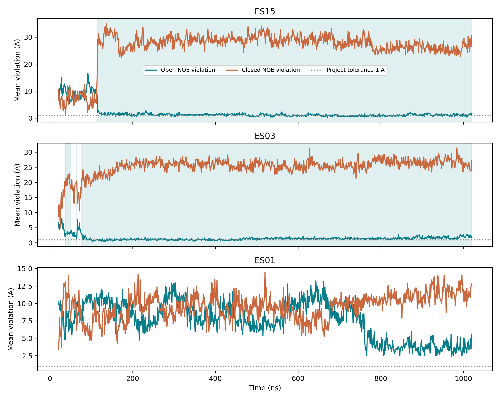
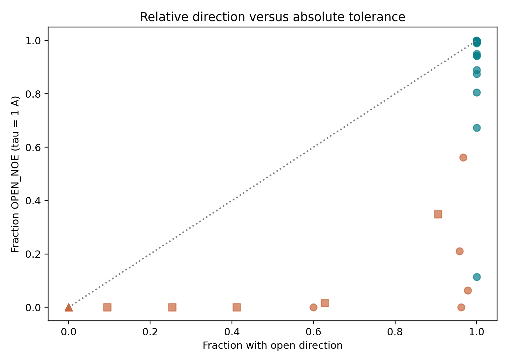
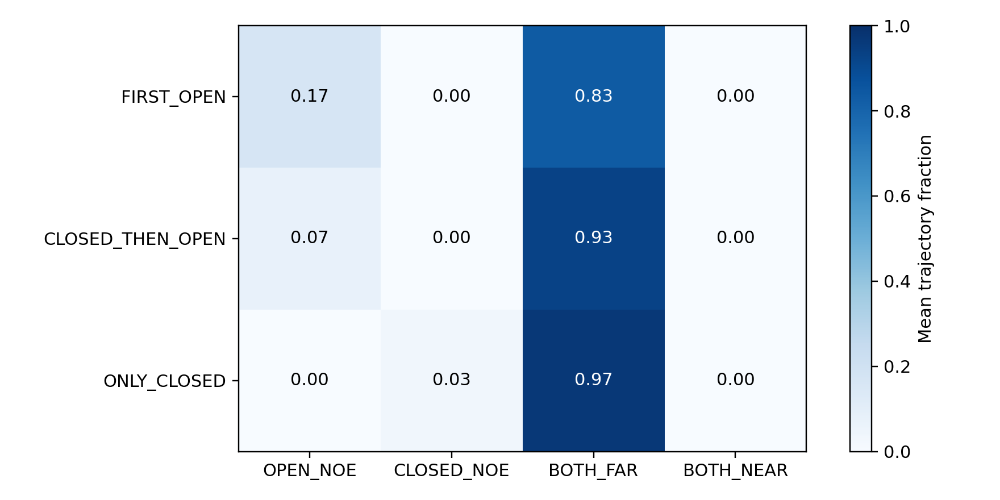

# HSP90 的开放方向变化与 NOE 参照匹配

## 1. 结论与它改变了什么

首轮的开放方向读数主要支持相对结构偏好变化，不能直接当作接近开放态的证据。在预先指定的 1 Å 容差下，10 条出现开放方向的闭合起始轨迹中，9 条的开放方向保存点至少有一半同时偏离两套 NOE 参照；另 1 条部分一致。开放起始组 18/20 条达到一致标准，阳性对照通过。

这不是把首轮 10/20 改成“零条有变化”。例如 ES15 的开态违例从前 100 点平均 9.0741 Å 降到末 100 点 1.1154 Å，改善明显；但以 1 Å 为界，它在全部开放方向点中只有 38.5% 达到开态近参照条件。报告必须同时说清改善幅度和判据限制。

## 2. 实际使用的数据与一次读数修订

使用本机已有 80 份作者文件，40 条轨迹各有开放/闭合两套序列，每套 1001 点。逐文件哈希与旧清单一致。原生索引 1–1001 对应 20–1020 ns。没有下载数据或新跑 MD。

首次运行在读取恒等检查失败：旧派生表的差值来自第三列伪距离违例，计划误认为第二列平均距离违例。我们在分类计算前记录了修订：第三列只核对原差值，第二列仍按原计划计算绝对违例。修订后 40 条轨迹的第三列差值与旧表完全一致，最大误差为 0。未改变任何分类阈值，也未查看分类结果后调整方案。第一次失败保留为历史证据。

NOE 是对原子近距离敏感的核磁观测；这里的违例表示超过参照距离上限的程度。第二列与伪距离版本不可混用。原生序列也是原分析来源的一部分，所以本轮是同源再分析，不是独立实验验证。

## 3. 怎么定义一致，以及为什么需要敏感性

逐点以 τ 为容差：开态违例≤τ且闭态违例>τ，记为开态近参照；反向为闭态近参照；两者均>τ，记为同时偏离；两者均≤τ，记为同时接近。论文的严格完全兼容是零违例，τ=0.5/1/2 Å 是项目操作性容差，不能写成作者的物理状态定义。

每条轨迹只在“开放方向”点内计算这些类别占比。开态近参照占比≥80%为一致；同时偏离占比≥50%为相对偏好；中间为部分一致。没有开放方向点的轨迹不适用这个条件判断，不算错误或失败。

|容差|闭合起始：一致 / 部分 / 相对偏好 / 不适用|开放起始：一致 / 部分 / 相对偏好|
|---|---|---|
|0.5 Å|0 / 0 / 10 / 10|7 / 8 / 5|
|1.0 Å（主值）|0 / 1 / 9 / 10|18 / 1 / 1|
|2.0 Å|3 / 2 / 5 / 10|19 / 0 / 1|

结果对容差敏感。0.5 Å 下连开放起始对照也只有 7/20 一致，说明不能把这一严格容差的负结果直接解释为结构不对。主值在分析前已经固定为 1 Å；这里没有选择最好看的阈值。

## 4. 逐轨迹结果怎样读

|例子|前100点开态违例均值|末100点均值|开放方向点中开态近参照比例|1 Å判读|
|---|---:|---:|---:|---|
|ES15：先闭后开|9.0741 Å|1.1154 Å|38.5%|相对偏好；变化显著但不少点略高于1 Å|
|ES03：首个持续方向即开放|2.8076 Å|1.8157 Å|22.0%|相对偏好；不能将首开当完整转变|
|ES04：首个持续方向即开放|4.4381 Å|0.6340 Å|58.1%|部分一致|
|ES01：只有持续闭合方向|8.9628 Å|3.7679 Å|不适用|无开放方向点可作条件分类|

首100点是[20,120) ns，末100点是(920,1020] ns。每条轨迹点数相同，但点彼此相关，表格不提供独立重复的统计显著性。

图中浅色条带表示开放方向保存点。ES15 在方向改变后，开态违例快速下降，但多数读数仍围绕项目容差附近波动。ES01 虽然开态违例也下降，两项派生读数没有形成开放方向共识。方向与绝对匹配需要分别看。

## 5. 参照带与论文分类的关系

开放起始组 20,020 个点的开态违例第95百分位为 1.32 Å。要求至少连续50个保存点（首末跨度49 ns）进入该带，闭合起始组有2条满足：ES04从188 ns，ES15从690 ns开始。开放起始组有19条满足。它回答的是进入本数据中开放组的经验参照带，不是独立校准的物理状态识别。

散点的横轴是每条轨迹的开放方向比例，纵轴是1 Å下开态近参照比例。蓝绿色为开放起始，橙色为闭合起始；圆/方/三角分别为首开、先闭后开、只闭。点重叠时不能靠视觉数轨迹，完整40行表提供精确分母。

检查了补充材料第16–17页；图只标a–t面板，没有ES轨迹编号。按预注册不猜映射，旧项目的曲线形状匹配也不当作作者明示编号。只保留组级比较：作者7/9/4为其原生分类，本轮10/10为是否出现开放方向的分组，分类规则不同。

热图是各轨迹类别比例的组内平均，按五点方向分区显示；不是把所有点当独立分子。两种方向分区均可能有大量“同时偏离”的时间，这正是只看相对方向会遗漏的信息。

## 6. 对三个科学问题的回答与设计决策

开放方向片段是否伴随开态违例降低？ES15、ES03等给出明确降低的实际例子；不能仅根据方向标签假定每条都降低，ES06的前末均值没有改善。完整逐轨迹表保留这些差异。

是否仍同时偏离两套参照？是。主容差下，9/10有开放方向的闭合起始轨迹在这些点中至少一半同时偏离。这个比例限定在预注册容差和条件点集，不能解释为9条模拟全部错误。

哪些更接近原生结构解释？ES04与ES15都能持续进入开放组经验参照带；但它们的整段判读仍不同，且1 Å与2 Å结论有变化。因此可支持“某些片段更接近开放NOE参照”，不能宣称完整复现论文分类或平衡占比。

对系统设计最直接的要求是让 Agent 保留读数定义、单位和前向计算版本，主动区分相对排序与绝对匹配。改进目标不应是让模型更忠实地复述旧方向标签，而应是让它知道标签足以回答什么、还差什么。规则渲染修复是另一个环节，其行为效果仍未重测。

## 7. 证据、复跑与边界

[逐轨迹表](../per_trajectory_crosswalk.tsv)、逐点表（40040行保存在本地任务包，未上传原始逐点资料）、[敏感性与控制](../group_summary.json)、[预注册及读取修订](../../protocol/PREREGISTERED_RULES.md)、[原失败](../alignment_failure.json)。脚本为 `scripts/noe_crosswalk_v1.py`，只读冻结输入，输出到任务目录。

共40040行逐点结果与40行逐轨迹结果。一次输入身份核查；一次原检查失败后，针对读取列定义修复并运行一次。主阳性对照通过。没有付费模型调用，没有新模拟，没有将阈值调整到作者7/9/4。论文面板身份未映射；没有新的实验验证或动力学参数估计。
