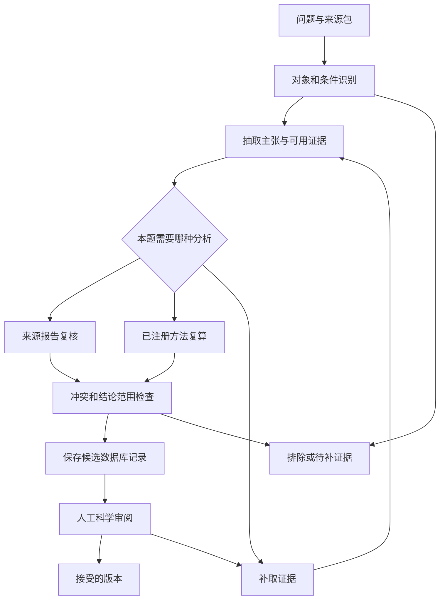

# Dynamics Atlas 的工作流与记忆架构（工程备选草稿）

**状态更新：本稿保留较早的数据库交付导向，尚未实现。用户已将当前目标明确为复刻科学家工作流及其分析，因此以 [实施计划 v1.0](../documents/PLAN_ZH.md) 第 6–7 节的最小架构和记忆机制为准。下文模块作为工程参考，不要求在首次案例复算前全部实现。**

建议把首版固定为 **单个分析 agent、一个确定性流程控制器、一份任务状态库和一套带来源的证据文件**。它先完成“从一篇论文及其公开数据生成可审阅数据库记录”的任务。多 agent、自动扩充方法库、向量数据库和原始谱的自主探索，等小规模试验显示需要后再加。

本文是 2026-09-20 的 v0.1 备选设计；不是已经批准或实现的架构基线。APO 定义及科学准入条件仍由 Soojung / Gina 确认。本轮没有修改旧 Rules Table。

## 1. Harness 在这里负责什么

模型负责读资料、提出解释、选择下一步动作。Harness 是围绕模型的执行程序，负责记住当前问题、提供允许使用的工具、实际运行请求、保存结果、检查能否进入下一步，以及在错误或中断后继续。

例如，模型认为需要比较两个结构。Harness 要先确定这两个文件对应什么蛋白、什么构建体和什么实验条件，再把明确的文件与参数交给工具。工具完成后，Harness 保存输出和来源，模型据此写候选解释，专家判断这个比较是否具有科学意义。一次工具调用成功只完成其中一部分。

外部工程资料给出的启发是可恢复任务状态、按需读取上下文以及把 agent 和 environment 分开；下面的具体模块与接口是针对本项目的设计。参考入口见 [来源说明](../SOURCE_STATUS.md)。

## 2. 首版产物先固定到一条数据库记录

**记录的科学单位建议定义为“蛋白构建体 × 条件 × 待判断状态主张”。** 同一篇论文可产生多个主张，但这些主张在统计上仍可能相关；同一蛋白在不同条件下不能直接合并。

每条记录至少回答下面这些问题。

| 内容 | 最小字段与意义 |
|---|---|
| 对象是谁 | 蛋白 ID、物种、序列/构建体、突变、残基编号映射；缺失写 unknown |
| APO 相对什么 | 目标配体/伙伴、作者报告的结合状态、证据位置；PDB 没有画配体不能自动判 APO |
| 条件是什么 | 温度、pH、缓冲液、浓度及影响本题的其他条件；保留单位和原值 |
| 提出了什么主张 | 一条可独立核查的短句、涉及哪些残基、是否给出时间尺度 |
| 证据从哪里来 | DOI / accession / 文件版本、页/图/表/STAR tag/行定位、原文摘录或数据范围 |
| 做过什么分析 | 采用的协议、算子版本、输入身份、参数、运行结果和不确定性 |
| 状态结构是否已知 | 未知、部分约束、来源报告的结构、完成核对的结构映射；结构链接允许为空 |
| 结论身份是什么 | 论文报告、当前复算、分析推断分别保存；不能用一种身份替代另一种 |
| 能进入哪里 | 候选池、待补证据、排除、待专家复核、已接受；另记人工审核人与版本 |

数据库记录不是把整段回答塞进一个文本框。来源、结果与主张必须能分别更新。例如论文被更正时，能找到受影响的主张和记录，而无需猜测哪些摘要提过它。

**证据身份和审核状态使用两个独立维度。** `SOURCE_REPORTED` 表示作者说过，不代表团队确认；`REANALYZED` 表示本次计算过，不自动比所有已有实验更可靠；`ACCEPTED` 只能来自有权限的人工审核。三者不能混成一个由低到高的分数。

## 3. 工作流固定阶段，具体路径由证据决定

这张图表达依赖，执行不要求机械走过所有方框。论文只支持残基级证据时，结构映射可标为不适用；原始数据缺失时，完成来源报告整理后可以交付待补证据记录。没有必要为了“完成流程”做一次无关的 MD 分析。

| 阶段 | 必须有的输入 | 阶段出口 | 证据不足的处理 |
|---|---|---|---|
| 任务定义 | 一个科学问题、允许来源、交付形式、预算 | TaskSpec 与禁止升级的结论 | 问题无法判定时先收窄问题 |
| 来源与对象核对 | PDF/数据、accession、基本元数据 | SourceManifest 与 ConstructCondition | 只阻止依赖缺失字段的动作，保留能完成的整理 |
| 证据提取 | 已识别来源与定位工具 | EvidenceItem 与候选 Claim | 缺 SI 就记录缺 SI；不从别的体系填空 |
| 分析选择 | 当前主张、可用数据、已批准的方法卡 | 有界 AnalysisPlan 或无需计算的理由 | 提议补证据、替代方法、降低结论范围、请求专家 |
| 工具执行 | 有效输入与已允许参数 | OperatorReceipt 与结果文件 | 按错误类型处理，不把执行错误写成科学否定 |
| 综合与挑战 | 主张、支持证据、反证与计算结果 | 每条主张的支持状态及剩余缺口 | 局部回退到相应阶段；不重做无关工作 |
| 候选提交 | 完整来源追踪、明确结论身份 | 不可被后续闲聊覆盖的记录版本 | 保存部分结果并标明未完成原因 |
| 人工收录 | 候选记录和可打开的证据包 | 接受 / 拒绝 / 要求补证据的签名记录 | 保留审核历史，不回写抹除旧版本 |

流程内保留三类规范。权限、费用和文件身份属于程序必须执行的约束；专家认可的方法前提写入具体方法卡；尚待验证的经验只作为带适用条件的建议。第一类约束不能交给模型自行决定是否遵守。

## 4. 模块及权限

| 模块 | 它负责什么 | 能改什么 | 首版做多大 |
|---|---|---|---|
| 任务登记 | 固定问题、输入、版本与预算 | 新任务配置 | 一个 JSON 配置 |
| 流程控制器 | 选择合法阶段、检查依赖、记录回退 | 任务状态 | 一套小状态机 |
| 分析 agent | 提议下一步、使用工具、写候选主张 | 只能提交提案 | 一个模型接口，固定版本 |
| 证据服务 | 定位来源、保留摘录、追踪派生关系 | 新增 EvidenceItem | 文件目录加索引 |
| 工具执行器 | 执行授权工具、限时、校验输入输出 | 隔离工作目录 | 少量成熟工具的薄包装 |
| 记忆与恢复 | 生成工作视图、保存 checkpoint、恢复任务 | 指定状态表与记忆提案 | SQLite 与 JSON/JSONL 导出 |
| 验证与审核 | 程序核查、专家复核入口、争议记录 | 审核意见与接受状态 | 先程序加人工，模型 judge 可选 |
| 运行与费用记录 | 每次调用、重试、结果、金额和耗时 | 追加事件与费用表 | 单进程、单任务 writer |
| 数据库导出 | 从接受的记录生成版本化数据集 | 新的导出版本 | JSONL / TSV；无需 Web 平台 |

模型看不到凭证、隐藏评分资料或接受状态的直接写接口。论文与工具返回值是数据，里面出现“忽略前文”“上传文件”等文本不会变成系统指令。正式入库与外部发布分别授权。

## 5. 控制器的最小执行协议

每轮 agent 提交一个结构化动作，包含当前任务版本、目标主张、要解决的缺口、工具与参数、预期获得的证据，以及一句可审核的选择理由。无需保存模型的私有推理链。

控制器按下面顺序处理。

1. 检查任务版本、阶段权限、预算和输入可用性。
2. 在事务中登记动作意图和幂等键，随后在隔离环境执行。
3. 将实际结果写入新文件，验证 schema、单位和来源引用。
4. 在同一个状态事务里关联结果、追加完成事件并前移状态；失败则保存失败事件。
5. 生成新的最小上下文，继续下一轮或交付停止原因。

动作幂等键由任务、动作类型、算子版本、输入版本与规范化参数生成。相同任务中的已完成动作优先复用结果；输入、参数或方法变了就创建新动作。不同实验组不得共享上一组的运行产物。

**中断恢复按实际证据处理。** 若工具已完成但状态未提交，恢复器核对结果文件与运行回执，再完成提交；有意图但结果缺失时，只对确定可重复的本地动作重试。远端调用是否执行、是否收费不明时，保存 `UNKNOWN_OUTCOME`，暂停相关动作进行对账，不承诺 exactly-once。

SQLite 保存 `runs / actions / events / evidence / claims / memory / reviews / cost_ledger`，结果大文件留在文件系统。导出的 JSON 便于审查，SQLite 是该运行的状态权威；摘要 Markdown 不反向覆盖它。跨文件写入采用临时文件、原子改名、事务提交与恢复核对，避免声称一次文件写入就覆盖了所有崩溃位置。

## 6. 记忆设计

需要长期保存的是任务事实、来源和已经发生的动作。对话摘要只是方便模型读取的一种视图。

| 记忆种类 | 保存内容 | 写入与读取规则 | 失效方式 |
|---|---|---|---|
| 项目约定 | 科学目标、权限、当前协议版本 | 人确认；每次任务初始化读取 | 新版本明确替代旧版本 |
| 任务状态 | 当前阶段、未决主张、已完成动作、预算 | 控制器写；恢复时优先读 | 由状态事务更新，不依赖模型记忆 |
| 来源与证据 | 原始文件定位、摘录、计算结果、支持/反对关系 | 抽取和执行生成提案；程序接纳结构 | 来源修订、撤回或算子变更使下游标为需复核 |
| 流程知识 | 专家认可的步骤、适用条件、失败后的动作 | 专家审核后发布；当前阶段按需加载 | 版本替换；适用范围变化时停用 |
| 案例经验 | 某个案例失败的条件、处理动作及结果 | 初始只在该 case 内可见；跨 case 使用需审核 | 标注是否过期、被反证、已失效 |
| 工作摘要 | 当前目标、待办、关键证据 ID、最近失败、下一步 | 从正式状态生成；每次压缩或恢复重建 | 随时可重建，不是事实来源 |

每条可复用记忆保留 `memory_id、kind、scope、content、source_refs、created_at、verified_at、status、supersedes、expires_at、workflow_version`。时间并不自动让科学证据失效；`expires_at` 用于链接、环境和操作信息，科学事实通过来源版本和撤回记录处理。

**写入路径固定为提案、核对、发布。** 模型说“这个蛋白的两个峰表示两个功能态”时，先保存为本例假设。只有来源支持、适用条件明确且专家认可，才可变为跨任务方法知识。自我反思和多次重复同一句话都不会自动增加可信度。

**读取先过滤范围，再做相关性排序。** 先匹配任务、构建体、条件、数据类型、方法版本和访问权限，再用关键词查找。向量相似度即使以后加入，也不能跳过这些过滤。没有匹配记忆时正常分析；不能为了命中某条记忆，把当前体系强行改写成旧案例。

**矛盾显式共存。** 新证据与旧证据相反时，保存两个来源及冲突原因，建立 `contradicts` 关系；未解决前不得把旧结论静默覆盖。修正输入时，标记依赖该输入的分析与主张过期，只有受影响部分需要重做。

**检索仍然保留。** 模型预训练知识不能替代当前论文的 SI、具体构建体与最新数据。首版以文件索引、关键词和 accession 查找为主，按需取出短片段；只有实际出现跨文档语义召回不足时，再测试向量检索。[Anthropic 的按需与混合检索说明](https://www.anthropic.com/engineering/effective-context-engineering-for-ai-agents)

## 7. 恢复时模型具体读什么

建议恢复包最多使用模型可用上下文的 20%，并另设 6,000 token 的初始上限。它包含任务目标与版本、当前阶段、未决问题、有效结果索引、最近失败、剩余预算及一个建议下一步。超过上限时先移出已完成步骤的叙述，保留主张和证据引用；不能为节省 token 删除未解决的矛盾。

启动顺序是读取 TaskSpec，校验 checkpoint 与源版本，处理未完成动作，重建恢复包，再由模型选择下一步。每完成一次有意义的状态变化就保存 checkpoint，不必每个 token 或每次读文件都写一份长摘要。

恢复后必须能回答四件事。现在要判断什么；哪些结果可用；哪些结论尚未证明；下一步为什么有必要。这四项缺一项，就先补状态而不继续计算。框架中的内存 saver 在进程退出后会丢失状态，选用框架时也必须配置真正持久化的存储。[LangGraph persistence](https://docs.langchain.com/oss/python/langgraph/persistence)

## 8. 工具从什么开始

首版共享工具面只提供来源搜索与读取、结构化证据记录、确定性表格/单位核查、已批准的分析算子、草稿提交五类能力。技术上可以由少量工具承载多个动作；工具数量不是目标。

| 能力 | 首版处理 | 需要补充的前提 |
|---|---|---|
| PDF / SI 读取 | 复用来源匹配的 Markdown，图表公式回到原页 | 记录解析器、页码与版次，主文和 SI 分开 |
| BMRB NMR-STAR 提取 | 读取实际存在的 data type、条件和赋值字段 | 确认 parser 与字段映射，不假设有原始谱 |
| PDB / 序列映射 | 记录链、构建体、缺失残基与编号映射 | 分开作者编号与规范编号，禁止按行号硬拼 |
| 表格与数值处理 | 限域脚本、单位检查、固定种子、结果回执 | 自由写出的分析草稿不能直接成为认可算子 |
| NMR 再拟合 | v0.1 不默认开放 | 专家冻结方法、拟合模型、误差、参数范围与阳性/阴性检查 |
| MD 对照 | 只有问题确实需要且数据可用才路由 | PBC、时间单位、统计单位和状态定义已核对 |

一个注册算子要有输入输出 schema、版本、环境、参数范围、适用前提、最小正确性样例与结论上限。旧 HSP90 算子的专用 NOE、轨迹和参考结构约定不能直接移植到任意 NMR 案例。

## 9. 卡住时按原因选择动作

| 观察到的问题 | 允许的恢复动作 | 最后仍不解决时 |
|---|---|---|
| PDF 顺序乱、图表读不清 | 改用已安装的解析路径；定点查看原页 | `NEEDS_SOURCE`，列出具体缺页/表 |
| 缺 SI、缺原始数据 | 查 manifest 和已授权来源；保留来源报告层 | `NEEDS_EVIDENCE` |
| 构建体、配体或条件不一致 | 拆成不同对象；请专家判断比较是否适用 | `OUT_OF_SCOPE` 或比较关系未决 |
| 数据不能区分多个解释 | 寻找已有正交证据或运行获准敏感性分析 | `AMBIGUOUS`，列出竞争解释 |
| 工具参数错误 | 用 schema 错误信息修正一次 | 同因第二次失败转人工，不猜参数 |
| 本地工具暂时故障 | 在总预算内重试一次，保留原失败 | `INFRA_ERROR` |
| 数值和主张不匹配 | 读取实际结果与单位；修正受影响的主张 | 保留失败草稿和更正记录 |
| 重复相同动作且没有新证据 | 检查是否还有能区分解释的动作；最多两次有理由的重新计划 | 保存未决项并停止 |
| 上下文重置或进程退出 | 读取正式状态与动作账本，恢复最后安全位置 | 状态损坏时停在人工恢复入口 |

“继续工作”的含义是有证据地选择下一步。不断重复同一查询或在证据不足时输出更强结论，都不计作进展。

## 10. 验证要和它能判断的事情相匹配

程序检查文件身份、字段类型、单位、参数范围、结果存在性、来源定位和费用边界。它可以确认某个结果文件是本次运行产生的，不能单凭文件存在确认科学解释正确。

领域专家检查状态定义、测量能否区分解释、条件可比性、结论范围与正式收录。模型 judge 可以先生成疑点清单，但必须在人工样例上测误报与漏报，再决定是否进入运行流程。它只提交建议，不能自行把记录改成接受。

评分优先看主张和数据库记录是否正确、能否找到支持证据。合法的另一种分析路线不因工具顺序不同被扣分。只有来源核对、权限、数据完整性等明确风险，才使用必须执行的阶段条件。[Anthropic agent evaluation](https://www.anthropic.com/engineering/demystifying-evals-for-ai-agents)

## 11. 复用现有工作，补齐真正缺少的部分

| 现有资产 | 建议处置 | 原因 |
|---|---|---|
| 33 条原始规则与来源定位 | 历史冻结保留；映射到参考资料、局部检查或待退休条目 | 不能把删表当作架构进步，也不再强制全部触发 |
| 来源包、source card、结果与回执 | 复用格式和可核对的内容 | 已有可追踪基础 |
| current-calculation 结果绑定 | 复用思想，增强到 claim 与数值字段级 | 防止只因数字在日志中出现就认定有支持 |
| 限域执行、费用账本、正式提交文件 | 从已审查路径提取薄组件 | 保留实际执行边界 |
| 原有上下文摘要 | 作为导出视图参考 | 所检 runtime 没有完整跨进程恢复入口 |
| 老评分数字和 exposed 案例 | 仅用于开发诊断 | 不纳入新试验的独立测试来源 |

迁移另开任务，旧实验目录只读。先做一条新 case 的纵向路径，确认“读来源 → 保存证据 → 提交候选 → 中断恢复”可运行，再扩大工具种类。具体源码位置见 [核对说明](../SOURCE_STATUS.md)。

## 12. 固定选择与未来触发条件

| 现在固定的选择 | 暂不采用的方案 | 什么时候重新评估 |
|---|---|---|
| 单 agent 加代码控制器 | 多 agent 常驻协作 | 独立子任务明确，且串行成本已经测出 |
| SQLite 加文件、单 writer | 分布式任务队列和服务集群 | 多人并发写入或规模超过本地管理能力 |
| 关键词与元数据检索 | 向量库默认常开 | 有人工标注的召回缺口，新增检索确实改善结果 |
| 专家发布方法版本 | 在线自主改 workflow 和长期记忆 | 先建立离线回归与变更审核，单独做自适应实验 |
| 原文证据与结构化结果 | 每篇论文都构造大型知识图谱 | 查询需求明确证明关系查询有额外价值 |
| 本地 JSONL / TSV 导出 | 先搭完整数据库网站 | 数据记录通过专家审阅后，实际用户需要查询界面 |

首版的工程完成标准是一次真实来源包可以生成可审阅记录、从中断恢复、识别过期依赖并完整交代停止原因。它的科学价值和人力收益，交给下一份实验计划检验。
