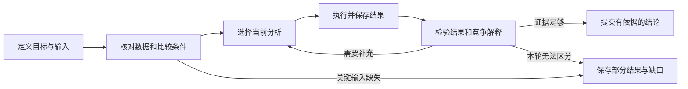

# 科学家工作流复刻与分析实验计划

版本 v1.0 · 2026-09-22 · 本轮稳定执行基线；冻结的是路线和交付口径，尚未实施新科学实验

**第一阶段的目标是选出两个有公开数据的案例，重建科学家怎样推进分析、怎样作判断，再实际复算一条关键证据链。9 月 24 日周四带着流程图、判断依据、复算结果或明确卡点去开会。** Harness 的首版围绕这两条真实分析路径设计。随后用同一个高推理模型检验工作流究竟增加了什么。

会议日为 2026-09-24；具体时间以团队已有约定为准。截至 9/22，审查包已发布，两个新案例的流程深读和科学复算仍未完成。本次完成自审、三名 subagent 的分工审查及一轮交叉讨论。它们是文档审查，不是领域专家认可。

## 0. 这版开始执行后保持什么不变

| 项目 | 固定内容 | 执行时可以填写的内容 |
|---|---|---|
| 目标 | 还原科学家判断流程，做有来源的分析，随后检验对强模型的增量 | 每个案例的具体图表、比较单元与输入层级 |
| 首批范围 | 两个开发案例，争取至少一个完成数值复算；至少一个案例体现实际 MD 工作 | 哪篇 MD 论文满足输入要求；未准入候选可以按既定备选规则替换 |
| 会前实现 | 使用现有工具、脚本、文件和简单任务状态完成分析 | 选择与当前问题直接相关的脚本和必要参数 |
| 后续试验 | 同强模型、同资料/工具/基本日志的 A/B/C 比较 | 数据、参考答案、模型版本、评分细则、资源上限在正式运行前一次确定 |
| 完成口径 | 流程重建、数值复算、解释支持分别验收 | 具体数值容差及其依据在第一次计算前写进案例卡 |

**先执行 [案例执行卡](CASE_CARDS_ZH.md)。** 今天先完成一个案例的输入检查和流程草图；数据条件满足才进入复算。第二案例的数据检查与首案分析可错开，不等待所有论文齐备后才开始。

计划保持到首批案例完成或遇到具体阻断，再结合一次领域反馈决定下一步。只有数据或方法前提被事实推翻、发现影响结论的错误、资源确实无法满足、或用户/领域专家纠正科学问题时，才改变相关条款。风格偏好、新框架建议和没有新证据的代理意见不触发改版。一般的文件名、例子和执行参数补全写进案例卡，不重写总体路线。

变更时记下“哪项事实变化、影响哪一步、最小修正是什么”，只更新受影响的卡或步骤，保留旧结果；不得看见模型组成绩后换题、改参考答案或放宽评分标准。冻结路线也不表示可以把尚未完成的数据、预算或科学判断当作已批准。

## 1. 我们要回答的三个问题

1. **流程能否被还原和执行？** 给出论文、补充材料和数据，能否重建从观察到结论的关键步骤，并说明每一步为何必要、遇阻后怎样处理？
2. **分析能否支持相近复杂度的结论？** 能否复算关键量，把多种证据组织成有条件的解释，完成一项相关的竞争解释或关键不确定性检查，并说清不能推出什么？
3. **工作流是否对强模型有额外帮助？** 高推理模型配备相同资料和工具，本身可能已经做得很好。新增流程必须通过结果、可靠性或人工投入的改善证明价值。

本轮的主要交付单位是一个**分析案例及其决策记录**。后续数据库可以接收经过审阅的结果，但先不让数据库收录标准支配这次工作流研究。

## 2. “复刻成功”具体是什么意思

| 层次 | 做了什么 | 可以怎样报告 |
|---|---|---|
| 流程重建 | 从全文、SI、代码还原步骤、依赖、输入输出，并定位来源 | 已整理出论文可支持的分析流程 |
| 数值复算 | 用公开数据实际运行分析，生成可以核对的数值或图 | 某项结果已复算；同时注明从原始数据还是处理后数据开始 |
| 解释复现 | 复算结果与其他证据共同支持论文的一条主要判断，完成相关挑战检查并说明剩余解释 | 在列明条件下支持相近结论，或发现具体差异 |
| 跨案例迁移 | 把开发时未见的新案例交给冻结后的系统 | 对这些新案例观察到某种效果，尚不能直接推广到全领域 |

读到作者结论后重新叙述，不计作数值复算。复现一张图也不自动等于复现整篇论文。使用作者拟合后的参数时，只能评价参数之后的处理和解释，不能声称重做了上游拟合。

**第一阶段目标：两个案例完成流程重建，至少一个完成数值复算，尝试完成解释复现。** 若数据不足，交付可定位的缺口和已完成部分；不保证周四前复现整篇论文。

每案使用同一套验收。流程重建完成，需要关键步骤有输入、输出、选择依据、来源身份和遇阻分支；数值复算完成，需要本次实际输出与预先约定的比较目标对应；解释复现完成，需要明确哪些论据来自本次计算、哪些来自作者报告，并检查本题的一种竞争解释或关键敏感性。仅有缺口清单可以完成会议讨论材料，不能计作复算成功。输入错误、身份/符号映射错误、没有计算却声称计算、或超出数据支持的核心结论，均作为严重错误单列，不能被总分抵消。

## 3. 文献怎样选，为什么要扩到五篇之外

用户提供的五篇是起始材料，全部保留。选文依据是能否展示不同的工作过程，以及是否有可运行的公开材料；不以蛋白数量或论文数量作为完成指标。

### 3.1 起始材料的用途

下表是阅读和筛选任务，尚不是逐篇深读后的结论。

| 起始来源 | 优先追踪的工作过程 | 首轮用途 |
|---|---|---|
| [ADK，2015](https://www.nature.com/articles/nsmb.2941) | 怎样组合结构、动力学与计算证据；不同实验条件如何对应 | 跨证据综合的候选案例 |
| [IL-2，2020](https://www.pnas.org/doi/10.1073/pnas.2000419117) | 怎样从构象差异推进到可检验解释；如何使用扰动或比较对象 | 判断逻辑的候选案例 |
| [K-Ras，2023](https://www.nature.com/articles/s41594-023-01070-z) | 怎样组织 WT 与突变体比较、解释激发态证据、处理不同解释 | 首个复算候选，先核对数据与 SI |
| [RfaH，2012](https://pubmed.ncbi.nlm.nih.gov/22817892/) | 怎样把结构变化与功能证据联系起来 | 构建证据依赖图 |
| [RfaH，2025](https://www.pnas.org/doi/10.1073/pnas.2506441122) | 怎样研究转换路径与动力学，哪些信息来自不同分析步骤 | 与前一篇对照，检查流程如何随问题变化 |

这些材料不应直接代表所有 MD 科学家的工作。还需专门补齐轨迹质量诊断、采样不足处理、模型检验和多种观测量综合等流程。

### 3.2 补充文献采用两种角色

**真实研究案例**用于观察一个问题怎样被推进。优先寻找公开轨迹或中间数据、分析脚本、SI 较完整的 MD 研究；首轮至少选一个。可先筛查 [FAST 自适应采样研究](https://doi.org/10.1021/acs.jctc.5b00737)，关注“已有结果如何决定下一步计算”的过程。若复刻需大规模重新模拟，就只保留为流程参考，另选可用既有数据重分析的案例。

**方法与质量指南**用于解释具体判断点，不计作复杂结论的复现实例。先采用 [模拟不确定性与采样质量指南](https://doi.org/10.33011/livecoms.1.1.5067)；筛查 [自动平衡段识别研究](https://doi.org/10.1021/acs.jctc.5b00784)，帮助设计“哪些数据可以进入统计”的步骤。它们不能替代真实科研案例。

执行时先筛查约 8–10 篇材料，再深读 2 篇主案例及必要参考。其余用户提供的论文在首案跑通后继续补齐下载和流程分析，不从任务清单中移除。覆盖够用就停止新增检索；这是有目的的案例选择，不声称系统综述或代表性抽样。

### 3.3 两个主案例的准入条件

- 实际取得可读主文，并取得所选分析步骤必需的 SI 说明、输入与方法定义；非本步必需的材料可以列为缺件，不阻塞独立步骤。下载失败与未公开分开记录。
- 有一条能够在本地现有环境中重算的证据链，输入单位、编号与实验条件能说明白。
- 目标结论需要多个判断步骤，不能仅靠抄摘要或一次均值计算完成。
- 至少能提出一个有资料可检验的竞争解释，或一个真实的不确定性问题。
- 数据规模与工具成本适合短期试做，不以启动新模拟为前提。

优先组合为 **K-Ras 或另一个实验结合计算的案例 + 一个明确的 MD 轨迹分析案例**。K-Ras 只是当前优先候选，取得主文 PDF 不等于已满足数据条件。单个候选的取数与环境排查暂定最多约 2 小时；仍无法建立最小可计算输入就记录原因，换备选。本轮两案的取数/环境排查合计先封顶 4 小时，包括备选；每个案例最多换一次候选。到限后保留流程草图与具体缺口，不继续扩大检索。这个上限只限制资料取得与环境排查，不包含后续科学分析时间。案例必须在比较模型效果之前选定，不能因为某组表现不好而换题。

## 4. 如何把论文整理成真正可用的 workflow

每篇论文先找一个具体的结论单元，例如“在这些条件下，哪些观测支持两个状态的关系，以及哪些解释仍无法排除”。然后向前追溯所需证据，建立依赖图，再按依赖安排执行顺序。

**每一步用同一张决策卡记录。**

| 字段 | 要写清楚的内容 |
|---|---|
| 当前观察 | 看到了什么现象、差异、异常或缺失？ |
| 当前问题 | 此时真正需要区分的解释是什么？ |
| 已有信息 | 数据、条件、前一步结果及具体来源位置 |
| 所选动作 | 查资料、变换数据、计算、拟合、比较或停止 |
| 选择依据 | 一两句可审阅的理由，以及动作适用的前提 |
| 实际产出 | 文件、图、数值、失败记录；不能只写“已分析” |
| 检查办法 | 哪种结果足以支持继续，哪种结果要求回退？ |
| 下一步分支 | 正常情况、矛盾情况、输入缺失时分别怎么办 |
| 来源身份 | 论文明确记载 / 根据依赖推断 / 专家补充 / 本次新增建议 |

论文通常只呈现整理后的研究叙事。它可以支持分析依赖，但未必能证明作者实际的时间顺序、曾试过哪些失败方法、为什么放弃某条路线。这些部分保留问号，在周四请专家校正；不写成已经观察到的真实工作经历。

例如，计划中的一个通用分支可以是：发现两组数据有差异 → 核对比较对象与条件 → 重算差异及不确定性 → 检查是否足以区分候选解释 → 支持、收窄或暂缓结论。是否需要这个分支、采用什么检验，由具体案例决定；这里没有预先规定科学结论。

每个案例最终形成一张流程图、约 6–10 张关键决策卡和一页缺口清单。步骤数量只是阅读规模预估，不作为评分标准。

## 5. 实际 Analysis 按什么顺序做

### 第一步：固定本次要重现的结果

选择论文中的一个图、表或明确主张，将本次目标、起始数据层级、输入条件与编号、所需方法、必要计算、挑战检查、比较办法和允许结论写入 [案例执行卡](CASE_CARDS_ZH.md)。先核对协议和字段，再确定排除项、数值容差及其依据，最后才运行分析。数据精度与算法定义决定实现层面的比较容差；实验不确定性另用于科学解释，不直接拿来掩盖实现差异。作者未写明的关键定义保留未决，不为填满卡片而猜测。

### 第二步：做最小输入包

下载并保留主文、SI 与数据的原件，分别登记来源。PDF 优先转为可检索 Markdown；重要图表、公式和编号回到原页检查。数据包需说明构建体、条件、单位、编号映射，以及从哪一步开始复算。

### 第三步：运行一条可追溯的分析路径

复用可检查的作者代码或现有工具，保存脚本、实际参数、环境说明和结果文件。先运行能回答当前问题的最小分析。开发中允许根据真实失败修正一个具体假设再运行，并记录前后变化；连续两次修复仍是同因失败时，先检查输入或方法前提，不能无理由重跑。需要额外工具时，先判断现有环境能否完成同一目标；新增依赖、付费服务或模拟另行处理。

### 第四步：比较并解释差异

逐项列出论文值、本次值、差异、容差和结果身份。再检查差异可能来自数据版本、选择范围、参数、拟合方式、随机性或实现问题。工具故障、输入缺失和科学结果不一致分别记录。

### 第五步：挑战自己的解释

选择一个真实有意义的检查，例如换一段时间窗、比较独立轨迹、改变合理参数范围、检查构建体或条件差异。具体项目在阅读案例后确定。不能为了展示“做了验证”运行与主张无关的检查。

### 第六步：输出三段结论

1. 哪些量已经复算，哪些仍引用作者报告。
2. 这些证据共同支持什么解释，怎样处理了竞争解释。
3. 哪些结论仍然缺证据，需要什么才能继续。

K-Ras 的首个取数目标具体化为主文 Fig.3 与 Table 2 中的化学位移比较，优先检查 Switch I 在 GDP 与随机线团两种参照下的比较是否可重算。Data availability 给出 [Dryad 数据入口](https://doi.org/10.5061/dryad.j6q573nm0)。这里固定的是取数与协议检查目标；数据文件、符号、残基筛选、WT/突变体合并方式、R²与RMSD定义仍需核对，尚未取得可计算输入。使用处理后参数只能报告下游比较，不能声称重新拟合了 CPMG/CEST；相似性也不等于唯一结构或实际 GDP 结合状态。详见案例卡及论文 PDF 第5、6、11页。

## 6. 首版 harness 固定哪些部分

保留的目标架构是 **一个分析 agent + 一个小的流程控制程序 + 文件与任务状态存储**。模型负责选择当前分析动作和解释结果；程序负责实际执行、保存状态、定位证据和约束资源。**周四前不新建控制器、SQLite 服务或通用工具注册系统**，先用现有脚本、来源文件、案例卡和简单 JSON 状态把一个案例跑通。实际出现重复配置、结果遗漏或恢复问题后，再实现解决该问题的薄组件。

固定的是各阶段要留下什么证据、结果怎样传递、怎样恢复和退出。具体分析方法与可行路线由案例决定。另一条同样成立的分析路线可以通过评价；不把模仿作者每一次工具调用作为成功条件。

| 首版组件 | 最小责任 | 何时实现 |
|---|---|---|
| 案例配置 | 目标、来源、输入层级、预算、结论边界 | 两个案例准备时 |
| 来源与结果索引 | 原件位置、图表/数据定位、输入到结果再到主张的关系 | 首次复算时 |
| 工具执行层 | 读文件、运行有界脚本、保存实际结果和失败 | 首次复算时 |
| 流程控制 | 检查本步所需输入、记录当前阶段、支持回退和退出 | 手动路径明确后 |
| 持久状态 | 当前问题、已完成动作、未决解释、下一步、剩余资源 | 首次跨会话恢复前 |
| 评审入口 | 输出结果、证据和缺口，供人复核 | 首个案例交付时 |

数据对应关系与程序执行顺序分别记录，避免把“工具执行完成”写成“科学比较有效”。旧实现中的来源定位、计算结果绑定和运行回执值得检查复用；是否兼容本次数据，要逐项验证。已有规则资产保留，新路径不默认加载完整规则表。

目前已有的详细架构草案可供工程参考，但其中“以数据库记录为首个产物”的顺序已被本计划替换。先验证工作流和分析路径，再决定需要保留多少工程模块。

## 7. 记忆机制怎样做才够用

原始证据、运行状态和可迁移经验用途不同，分别保存。

| 层次 | 记住什么 | 写入和使用方式 |
|---|---|---|
| 案例状态 | 正在回答的问题、已完成分析、有效结果、未决解释、失败与下一步 | 每次有意义的状态变化后保存；新会话据此恢复 |
| 证据记录 | 原始来源、参数、实际结果、主张与支持/反对关系 | 原件保留，派生结果有版本；摘要通过引用访问它们 |
| 流程经验 | 某种条件下哪个动作有用、怎样识别不适用、失败后如何处理 | 先作为本例经验；领域审核后才进入跨案例流程库 |

模型的临时总结不成为事实来源。一个案例中推断出来的经验也不会自动变成其他蛋白的规则。正式评价时冻结流程库，并隔离不同运行的案例状态，防止前一组答案泄漏给后一组。

首版用文件和 JSON 状态即可完成手动试做；需要程序化中断恢复时采用 SQLite 保存动作和状态，大文件仍留在目录中。初始化时读目标、最新有效结果和未决问题，按需要检索来源。暂不引入向量数据库或自主更新长期记忆。

恢复功能至少要能处理两种情况：进程中断后继续使用已经完成的结果；输入改动后将依赖旧输入的结论标为需复核。对于付费调用是否已完成无法确认的情况，保存待核对状态，不能自动反复调用。

## 8. 怎样检验“强模型自己就能做好”

### 8.1 周四之前：先验证任务是否成立

首先完成案例、参考结果和流程草稿。当前助手参与过选题与读文，所以本轮人工监督的试做属于开发材料，不用它报告模型泛化或 harness 的因果效果。

### 8.2 会后第一轮：三个方案分开比较

| 组别 | 相同部分 | 新增部分 | 回答的问题 |
|---|---|---|---|
| A：高推理基础 agent | 同一模型版本、推理档位、资料、分析工具和资源上限 | 普通任务指令与基本执行环境 | 强模型本身可以做到什么？ |
| B：提供工作流 | 与 A 相同 | 冻结的工作流说明与决策卡 | 给流程知识是否有帮助？ |
| C：工作流加控制程序 | 与 B 相同，且可调用相同分析能力 | 自动记录阶段、检查局部依赖、提示恢复或停止 | 外部执行控制是否有额外价值？ |

A/B/C 都保留相同的外部调用日志、文件、资源计数和基本任务隔离；这些共同设施不算 C 独有的科学能力。C 的处理差异是模型可见的阶段状态、依赖检查、恢复与停止干预，B/C 都不能获得额外数值答案或独占分析工具。B–C 只能解释为这组控制/状态机制的组合效果，不能进一步归因给某一个模块。控制器额外引起的调用和计算计入 C 的资源用量；它的阶段检查只能使用当前可见输入和本次结果，不能读取隐藏评分答案。首次编写流程、控制器及人工审阅的成本单列。

不以较弱模型作为唯一基础组。模型与 reasoning 设置在试跑前固定，正式运行中不按结果更换。A、B、C 都能访问相同资料和计算能力；不沿用“只有处理组才能调用关键分析工具”的对比来证明工作流有效。

A 与 B 的差异同时包含专家流程知识和表达方式，因此只能解释为“提供这套流程的整体作用”。若 B 明显改善，下一轮增加“相同事实和方法提示、去掉步骤依赖的知识说明”组，才进一步区分知识增加与流程组织的作用。

### 8.3 建议规模与冻结办法

- **以下 4+36 次均属于会议后阶段。** 案例、参考结果、评分人/评分办法、模型和费用上限就绪后才启动，不作为周四交付条件。
- 先用开发案例做 4 次工程试跑：A/B/C 各至少一次，第4次检查终止或恢复。检查数据读取、真实输出和成本；这些运行不进入正式结果。
- 正式小试选择 6 个未用于编写流程的新案例，覆盖至少 3 种工作过程。每案 3 组，每组 2 次独立重复，共 **6 × 3 × 2 = 36 次**；含试跑共 **40 次**。
- 同蛋白、同数据来源及其派生题归入同一案例簇，整体放在开发或评价一侧。RfaH 的两篇文献不自动算作两个独立体系。
- 预先冻结输入包、流程、评分依据、模型设置和运行顺序；三组按案例配对并打乱执行顺序。
- 所有重复使用独立工作目录，不能读取另一组输出。若模型提供 seed 则记录；不假设设了 seed 就必然得到确定性结果。

这个规模用于发现失效机制和判断是否值得继续，统计单位是案例/体系，不能把 36 次运行当作 36 个独立科学样本。报告逐案表现与重复差异，不以小样本显著性宣称普适优势。模型可能在预训练时见过论文，也需记录为不可完全排除的限制。

### 8.4 先解决评价答案泄漏

流程重建任务允许读取整篇论文。分析能力评价则单独准备包，明确模型能看到哪些原始数据、中间数据、方法和参考材料；目标结果与评分资料不放入其工作目录。该类任务同时限制联网或检索直接取回目标答案，并隔离其他运行目录；三组使用相同的可见材料和访问范围。若不能落实这一条件，就将任务归为开放论文复现，不称作无答案分析。

若任务允许读到完整结论，就将其命名为“开放论文复现”，成功必须包含实际计算和证据绑定。另设不提供目标结果的分析任务，才能更有力地判断模型是否独立完成了推断。两类任务分别报告。

### 8.5 评分、成本和停止条件

每案在运行前拆成若干关键结论单元，注明必要证据、允许的替代方法和不可越过的结论边界。评分至少包含以下维度，分别报告，不用总分掩盖严重错误。

| 维度 | 实际检查 |
|---|---|
| 数值复现 | 必需量是否实际算出，是否符合预设比较标准 |
| 科学解释 | 是否支持关键判断，是否处理了本题要求的竞争解释 |
| 证据可查 | 关键主张是否对应本次结果或明确标注的原文来源 |
| 判断与停止 | 是否识别条件不匹配、数据不足和不能推出的结论 |
| 人工与计算成本 | 人工核查/修正时间、调用费用、耗时及无效动作 |

领域专家用匿名输出核查关键科学判断；程序核查实际数值与来源，模型评分只作辅助。不能仅用同一个模型自己打分就称为科学验证。专家人数和分歧处理如实报告；单人评分就标为单人评分。

初始单次运行上限建议 20 分钟、40 次工具调用。试跑后、正式评价前统一修订并冻结。4 次试跑也必须在开始前设定各次与合计费用上限。正式付费预算再由 4 次试跑的实测费用决定：试跑实际支出加上 **36 × 正式单次费用上限**；模型 ID、单次和全轮费用上限尚未设定，配置完成后才开跑。本计划不视作费用批准。

正式前在案例卡中逐条列出必要结论和严重错误，并定义人工修正任务。判断“A已足够”至少要求：该轮每个案例的两次重复都覆盖必要单元、没有严重错误，且没有反复需要人工纠正的同类缺口。任何未满足项都按案例报告，不能借平均分称为全部可靠。若基础组满足这一条件，保留简单方案；若增加工作流要解决真实缺口，应显示对应缺口得到修复且未引入新的严重错误。人工时间与费用没有测量时，不声称更有效率。这是这轮小试的选择依据，不是普适正确率阈值。

运行记录区分“预定slot”和“尝试”。正式slot固定为36个，所有组失败的slot都报告；科学结果不一致、工具使用错误或回答不完整，不能通过重试挑最好结果替换。仅可对已识别的临时基础设施故障追加最多一次恢复尝试，不改输入、提示或评分；记录原始失败、恢复结果与累计费用/时间，恢复必须仍在同一slot的资源上限内。调用是否完成或收费不明时先对账，不自动重发。主结果按36个预定slot完整报告，并另列首次完成和经恢复完成；36不是包含恢复尝试后的总调用次数。

以下是事先约定的设计去留原则。

- 如果 A 已能稳定完成案例，优先保留简单方案；不因为已有架构草稿就继续增加模块。
- 如果 B 改善遗漏或解释，而 C 没有进一步改善，则保留工作流说明，暂不扩建控制器。
- 如果 C 主要改善中断恢复与证据记录，就按工程收益报告，不写成科学推理提升。
- 如果主要障碍是数据不可得、方法定义或参考答案不足，先修案例与分析协议，再评价模型。
- 出现处理组独占资料、评分泄漏或输入错配时，受影响结果不能解释为工作流效果；修复后形成新版本，保留旧记录。

记忆效果另做后续小测试。可从两个案例的同一有效检查点开始，每案有/无恢复包各运行两次，共 **2 × 2 × 2 = 8 次**，比较恢复正确性、重复计算与遗漏。它与上述 40 次不混报；模型、检查点与来源相同，仅恢复包可见性不同。这只能评价恢复帮助，不能证明长期科学记忆有效。

## 9. 到周四如何安排

以下从 9/22 的真实进度开始安排，9/21 未完成的工作不回填。主要执行者负责取得材料、填写案例卡、运行获准分析和保留证据；用户及 Soojung/Gina 负责纠正科学判断与决定后续范围。时间是工作量估算，不是完成承诺，9/24会议时间未另行核对。

| 时间 | 要完成的工作 | 可查看的产物 | 当天结束条件 |
|---|---|---|---|
| 周二 9/22，约 4–6 小时 | 完成输入检查、两张案例卡和流程草图；首案就绪则开始复算 | 数据/协议状态、来源定位、实际已做动作 | 知道哪些步骤可执行；到取数上限即保留具体缺口 |
| 周三 9/23，约 5–7 小时 | 优先跑通首案结果比较和挑战检查；补第二案流程，输入就绪则局部复算 | 论文结果/本次结果对照，失败与未决解释 | 首案有复算证据或可定位的停止理由，不为凑数量跳过检查 |
| 周四 9/24 会前，约 1–2 小时 | 固定展示文件，做一次阅读与演示检查 | 6–8 页会议材料及可打开的证据文件 | 讲述顺序清楚、数字可追溯、状态没有夸大 |

优先级为“首案完整证据链 → 两案流程可解释 → 第二案局部复算 → 更多论文”。若时间不足，保留一个完整例子和一个清楚的卡点例子。不会为了凑齐两篇完整复现而缩短必要检查。

周四之后，根据专家纠正更新流程，建立参考结果与评分标准，然后才进入强模型对照和最小 harness 实现。新的模型试验另行完成运行配置与现有项目状态核对。

## 10. 周四给他们看什么

建议用 15–20 分钟说明以下内容。

1. **目标与假设。** 从科学家工作过程入手；强模型可能已经足够，实验允许得到这个结果。
2. **两个案例的流程图。** 正常路线、关键判断点，以及证据不足时的分支。
3. **一个真正打开的分析结果。** 输入、脚本或参数、输出、与论文的比较；没有运行的内容明确写计划。
4. **一处具体分歧或卡点。** 说明还缺什么信息、为什么目前不能继续下结论。
5. **最小系统与后续比较。** 模型负责什么，程序负责什么，怎样判断值得继续做。
6. **请专家校正的三个问题。** 哪些判断点还原错了；他们遇到这种卡点通常先做什么；哪些中间结果足够支持结论、哪些需要额外检查。

会议目标是获得对流程真实性、判断充分性和下一批案例的反馈。科学定义有分歧时记录下来，不由系统自行改成统一标准。

### 现在已有的东西能否展示

**可以用于内部讨论。** 会议记录、已有算子和结果绑定示例、本轮工作流计划都能帮助解释方向。展示时标注来源与日期。

历史 HSP90/ADK 算子实验可以说明“已有分析如何产生可追踪结果”。其[本地报告](../history/OPERATOR_REPORT_ZH.md)记录了固定输入、实际运行与尚缺第二评分人的情况；旧对照还存在工具可用性差异。因此它不回答本计划中的“强模型与同工具 workflow 对比”问题，也不能作为新工作流已有效的证据。

这份方案属于执行设计；新论文工作流深读、完整 Analysis 复刻和正式对照尚未完成。[审查包已发布为草稿 PR29](https://github.com/alex051107/dynamics-atlas-harness/pull/29)，没有合并，也未在本任务中自动发送给 Pro。对外是否有新颖性、是否可以投稿，是后面的独立问题。

## 11. 执行检查与工作量控制

| 功能批次 | 计划检查与次数 | 触发和停止条件 | 更新文件 |
|---|---|---|---|
| 本轮计划交付 | 1 次上下文准入；自审1次、用户要求的3名 subagent 分工审查与交叉讨论1轮；1 次文档/链接/算术核对；hash只用于变更文件传输 | 必要歧义已修正即交付，不再增加评审轮 | 计划、案例卡、讨论处置、任务状态 |
| 文献与流程提取 | 每个入库批次 1 次 PDF 身份/可读性/来源检查；单轮 inline 自审；0 独立审查；0 常规 hash | 新文件实际入库时；可读且关键步骤有来源后停止，不反复转换相同 PDF | 来源清单、阅读衍生本、流程与决策卡 |
| 单案例 Analysis | 默认1次基线执行、1次比较/目标相关检查；有真实失败才记录一项修正并重跑受影响部分；0 独立审查；0 常规 hash | 输入与比较标准明确后；同因连续两修不解先复核前提；达到边界或确定缺口即停止 | 参数、结果、修正理由与主张来源表 |
| 最小 harness | 1 次聚焦的状态保存/恢复检查；当前执行者自审；0 独立代理；0 常规 hash | 状态或执行代码改变时；真实案例能保存并恢复后停止，不扩建平台 | 状态协议、执行器、恢复记录 |
| 模型比较 | 1 次输入准入、4 次试跑、36 次正式运行、1 次匿名汇总；领域评审一次集中进行；1 次冻结输入身份计算 | 参考结果、模型及预算确定后；达到预设规模即停止，不重跑挑最好答案 | 冻结清单、回执、全部输出、评分与差异报告 |

修复后只重检受影响项目。文档工作不运行全仓库测试或 build；历史科学结果不因整理计划而重算。真实故障、安全或数据身份问题可以触发额外检查，但要说明新增风险。

## 12. 首先执行的动作

**打开 [案例执行卡](CASE_CARDS_ZH.md)，先完成 K-Ras 的 Fig.3/Table 2 取数检查，再核对一个真实 MD 案例。** 每个候选先回答“要重现哪条结论、需要哪些输入、当前能拿到什么”。未取得的数据继续写未取得，方法定义不清就定位缺口；卡片达到就绪条件后再运行分析，不因总体路线已冻结就跳过实际前提。

本计划的完成不等于上述实验已经完成。后续每个案例都用“来源已取得、流程已重建、计算已执行、解释已复核”四项状态单独报告。
